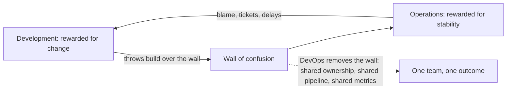

# Module 01: What is DevOps? — Handout

## Learning objectives

By the end of this module you should be able to:

- Describe the "wall of confusion" between development and operations and explain why it made software delivery slow and risky.
- Summarize the origin of the DevOps movement: the 2009 Velocity talk by John Allspaw and Paul Hammond, Patrick Debois and the first DevOpsDays, and the movement's Agile roots.
- Define DevOps as culture, practices, and tooling — and explain why it is not a job title, a team, or a product.
- Explain each pillar of the CALMS model and the Three Ways from *The Phoenix Project*.
- Name and define the four DORA metrics and place a team on the low-to-elite performance spectrum.
- Recognize common DevOps anti-patterns in real organizations.

## The world before DevOps

For most of the 1990s and 2000s, software organizations were split into two groups with structurally opposed incentives. Development teams were rewarded for shipping features: their success metric was change. Operations teams were rewarded for uptime: their success metric was the *absence* of change. Both groups were doing exactly what they were measured on, and the result was organizational gridlock.

The handoff point between them became known as the **wall of confusion** (a phrase popularized by Lee Thompson and Andrew Shafer). Developers finished code and threw a build artifact over the wall; operations received it with no context — no runbook, undocumented configuration, dependencies that existed only on a developer's laptop. When the deployment failed, the argument was predictable: "it works on my machine" versus "your code broke my servers." Because responsibility ended at the handoff, nobody owned the end-to-end outcome.

The typical release cadence was quarterly or worse: a freeze period, a weekend-long bridge call with dozens of people, and a manual runbook that could run to hundreds of steps. Because each release bundled months of changes, the blast radius of any failure was enormous, and diagnosing which of several thousand changed lines caused the outage could take hours. The rational response was to release even less often — which made each release bigger and riskier still. This **batch-size death spiral** is the central dynamic that DevOps reverses: lean manufacturing had shown decades earlier that small batches surface defects earlier and cheaper.

The industry's working assumption was that speed and stability trade off against each other. One of the most important research findings of the last fifteen years — covered below under DORA — is that this assumption is false: the highest performers are simultaneously the fastest *and* the most stable.

## Where DevOps came from

**Agile roots.** The 2001 Agile Manifesto transformed how software was *built*: short iterations, working software over documentation, continuous customer feedback. But Agile's finish line was "code complete," not "running in production." A team could run flawless two-week sprints and still deploy quarterly, because the wall of confusion sat downstream of everything Agile touched. DevOps extends Agile principles through deployment and into operations.

**The Flickr talk.** In June 2009, at the O'Reilly Velocity conference, John Allspaw and Paul Hammond of Flickr delivered a talk titled **"10+ Deploys per Day: Dev and Ops Cooperation at Flickr."** At a time when most enterprises deployed a few times a year, Flickr was deploying more than ten times per day — safely. Their recipe combined tooling (automated infrastructure, shared version control, one-step build and deploy, shared metrics and alerting) with culture (blameless incident response, mutual respect, dev and ops sharing responsibility for outcomes). The talk is widely regarded as the founding moment of the DevOps movement.

**DevOpsDays.** Patrick Debois, a Belgian consultant who had been frustrated for years by the dev/ops divide on the agile projects he worked on, watched the Flickr talk remotely. In October 2009 he organized a two-day conference in Ghent, Belgium, called **DevOpsDays**, bringing developers and operations engineers into the same room. On Twitter, the conference hashtag #devopsdays was shortened to **#devops**, and the movement had its name. Note what this implies: DevOps was named by a hashtag, not defined by a standards body. There is no official specification, which is why definitions vary and why vendors can market almost anything as "DevOps."

**Maturation.** The movement acquired its canon over the following decade: *Continuous Delivery* (Humble and Farley, 2010) codified the deployment pipeline; *The Phoenix Project* (Kim, Behr, Spafford, 2013) made the ideas legible to management through fiction; the annual **State of DevOps** reports (from 2014, later run by the DORA team at Google) added statistical rigor; *The DevOps Handbook* (2016) became the practitioner's manual; and *Accelerate* (Forsgren, Humble, Kim, 2018) presented the research behind DORA's findings.

## A working definition

> DevOps is a culture and set of practices, supported by tooling, that enables organizations to deliver software frequently, reliably, and safely by breaking down the barrier between development and operations.

The three layers are ordered deliberately. **Culture** — shared ownership of production outcomes, blameless learning from failure — is the foundation. **Practices** — continuous integration and delivery, infrastructure as code, monitoring, small batches — express that culture as concrete ways of working. **Tooling** — Git, GitHub Actions, Docker, Kubernetes, Terraform, Prometheus, all appearing later in this course — implements the practices. Organizations that adopt the tools without the practices and culture get, at best, a faster version of their existing dysfunction.

Amazon reached the cultural conclusion independently and early. In a 2006 ACM Queue interview, CTO Werner Vogels described their model: **"You build it, you run it."** Teams that operate the services they write receive direct, unfiltered feedback from production, and carrying the pager changes how engineers write code — they add structured logging, health endpoints, and graceful shutdown because they personally feel the absence of those things at 3 a.m. The course sample app embodies this in miniature: it ships with `/health`, `/metrics`, and a SIGTERM handler, because that is what operable software looks like.

## The CALMS model

CALMS is a five-pillar lens for assessing DevOps adoption, originating as CAMS with Damon Edwards and John Willis; Jez Humble added the L.

**Culture.** Shared responsibility for outcomes and psychological safety. The flagship practice is the **blameless postmortem**: after an incident, the team analyzes systemic causes (missing tests, ambiguous runbooks, alert gaps) rather than assigning individual blame. Etsy demonstrated in the early 2010s that engineers in a blameless environment volunteer far more detail — exactly the information needed to fix systems. In a blame culture, the recorded root cause is always "human error," and nothing improves.

**Automation.** Builds, tests, deployments, infrastructure provisioning, and rollbacks should be executed by machines. Humans cannot reliably execute a 200-step runbook under pressure; a script executes step 147 identically every time and leaves an audit trail. A useful rule of thumb: once you have performed a task manually three times, automate it. A caution: automating a process you do not understand simply produces failures at machine speed — map the process first (today's lab does exactly this).

**Lean.** Small batches, limited work-in-progress, and elimination of waste, borrowed from the Toyota Production System. A deployment containing 5 changes is dramatically easier to review, test, and — when it fails — debug than one containing 500. Small batch size is the hidden engine behind nearly every DevOps practice: continuous integration, trunk-based development, and canary deployments all exist to shrink batches. **Value-stream mapping**, the lab exercise for this module, is the lean technique of drawing every step from idea to production and measuring how much of the elapsed time is actual work versus waiting.

**Measurement.** Decisions should be driven by data about both the delivery process (the DORA metrics, below) and the running system (latency, error rates, saturation — module 11). Metrics must be shared: when everyone looks at the same dashboard, the argument about whose fault an incident is dissolves into a joint investigation. Beware vanity metrics such as lines of code or tickets closed, which measure activity rather than outcomes.

**Sharing.** Knowledge silos are single points of failure: if only one person understands the deployment process, the team's "bus factor" is one. Practices include documented postmortems, shared runbooks, internal tech talks, pairing developers with operations engineers, and inner-source repositories.

## The Three Ways

*The Phoenix Project* and *The DevOps Handbook* organize DevOps principles into Three Ways:

1. **The First Way: Flow.** Optimize the entire left-to-right flow of work from business idea to running code in production. Techniques: make work visible (kanban), reduce batch sizes, identify and elevate bottlenecks, remove handoffs.
2. **The Second Way: Feedback.** Create fast right-to-left feedback loops at every stage: unit tests that fail within minutes of a bad commit, deployment pipelines that halt on regressions, production telemetry and alerts, customer usage data. The faster the loop, the cheaper the correction.
3. **The Third Way: Continual learning and experimentation.** Build a culture that takes risks safely, learns from both failure (blameless postmortems) and repetition (game days, chaos drills), and turns local discoveries into global improvements.

The Ways are sequential: you cannot act on feedback that arrives too late, and you cannot get fast feedback through a pipeline with no flow. This course follows the same arc — modules 2 through 8 build flow, modules 5 and 11 build feedback, and module 12 addresses learning and reliability culture.

## DORA metrics

DORA (DevOps Research and Assessment) is the research program, founded by Dr. Nicole Forsgren, Jez Humble, and Gene Kim, behind the annual State of DevOps reports. Surveying tens of thousands of practitioners over more than a decade, DORA identified four metrics of software delivery performance that statistically predict organizational outcomes, including profitability and market share:

| Metric | Definition | Measures |
| --- | --- | --- |
| Deployment frequency | How often the organization deploys code to production | Speed |
| Lead time for changes | Time from code committed to code running in production | Speed |
| Change failure rate | Percentage of deployments causing a production failure (requiring hotfix, rollback, or patch) | Stability |
| Time to restore service | Time to recover from a production failure | Stability |

Benchmark bands from the 2021-2023 report era:

| Metric | Elite | High | Medium | Low |
| --- | --- | --- | --- | --- |
| Deployment frequency | On demand (multiple per day) | Weekly to monthly | Monthly to twice a year | Fewer than once per 6 months |
| Lead time for changes | Under 1 hour | 1 day to 1 week | 1 week to 6 months | Over 6 months |
| Change failure rate | 0-15% | 16-30% | 16-30% | 46-60% |
| Time to restore | Under 1 hour | Under 1 day | 1 day to 1 week | Over 6 months |

Three points deserve emphasis. First, the headline finding: elite performers are better on *all four* metrics simultaneously — speed and stability are not a trade-off but co-products of the same practices (small batches, automation, fast feedback). Second, definitions matter: DORA's lead time clock starts at *commit*, not at ticket creation, though the idea-to-commit gap is also worth mapping in a value stream. Third, Goodhart's law — "when a measure becomes a target, it ceases to be a good measure" — applies with full force. The metrics diagnose a delivery *system*; using them to rank individuals or teams against each other invites gaming (deploying no-op changes to pad frequency) and destroys the honest incident reporting that change failure rate depends on.

## Anti-patterns

- **The DevOps team silo.** A new "DevOps team" between dev and ops replaces one wall with two. (Team Topologies documents this anti-pattern; a *platform* team building self-service tooling is the healthy alternative.)
- **Rebranded ops.** Renaming the ops team "DevOps" while keeping the same ticket queues and handoffs changes nothing.
- **Tools-first adoption.** Installing Kubernetes or buying a CI product and declaring transformation complete. Tools amplify existing culture; they do not replace it.
- **DevOps by decree.** Leadership mandates DevOps without funding training, hiring, or the slack time needed to automate. Teams comply in name only.
- **Misreading "you build it, you run it" as NoOps.** Eliminating operations engineers instead of embedding operational expertise into product teams discards exactly the knowledge the movement is trying to spread.

## What this course builds

Over 12 modules and 14 weeks, one application — `devops-demo-app`, a zero-dependency Node.js HTTP service with `/`, `/health`, and `/metrics` endpoints — travels the full delivery journey: into your own Git repository with a real review workflow (module 2), onto Linux and networking foundations (module 3), through a GitHub Actions CI pipeline with quality gates (modules 4-5), into Docker and Kubernetes (modules 6-7), onto Terraform-provisioned infrastructure with managed configuration and secrets (modules 8-9), deployed progressively (module 10), observed with Prometheus and Grafana (module 11), and hardened with DevSecOps and SRE practices (module 12). The app is deliberately trivial so every hour of the course goes to the delivery system around it.

## Key takeaways

- The pre-DevOps split between dev and ops created opposing incentives, a wall of confusion, and a batch-size death spiral of ever-larger, ever-riskier releases.
- DevOps emerged in 2009 from the Flickr "10+ Deploys a Day" talk and Patrick Debois's first DevOpsDays; it extends Agile past "code complete" to "running in production."
- DevOps is culture + practices + tooling, in that order. It is not a job title, a team on the org chart, or a product.
- CALMS (Culture, Automation, Lean, Measurement, Sharing) is a lens for assessing adoption; the Three Ways (flow, feedback, continual learning) describe the underlying principles.
- The four DORA metrics — deployment frequency, lead time for changes, change failure rate, time to restore — show that elite performers are both faster and more stable than low performers, refuting the speed-versus-stability trade-off.
- Watch for anti-patterns: the DevOps silo, the rebranded ops team, and tools-first adoption.

## Further reading

- Gene Kim, Kevin Behr, George Spafford — *The Phoenix Project* (IT Revolution, 2013). The novel that made DevOps legible; read it first.
- Gene Kim, Jez Humble, Patrick Debois, John Willis — *The DevOps Handbook*, 2nd ed. (IT Revolution, 2021).
- Nicole Forsgren, Jez Humble, Gene Kim — *Accelerate* (IT Revolution, 2018). The research behind the DORA metrics.
- John Allspaw and Paul Hammond — "10+ Deploys per Day: Dev and Ops Cooperation at Flickr," Velocity 2009: https://www.youtube.com/watch?v=LdOe18KhtT4
- DORA research and current State of DevOps reports: https://dora.dev/
- Werner Vogels interview, "A Conversation with Werner Vogels," ACM Queue, 2006: https://queue.acm.org/detail.cfm?id=1142065
- Jez Humble and David Farley — *Continuous Delivery* (Addison-Wesley, 2010).
- Matthew Skelton and Manuel Pais — *Team Topologies* (IT Revolution, 2019), including its DevOps anti-pattern catalog: https://web.devopstopologies.com/
