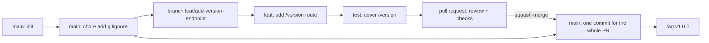

# Module 02: Git & Collaboration Workflows — Handout

## Learning objectives

By the end of this module you should be able to:

- Explain Git's data model: commits as snapshots, history as a directed acyclic graph (DAG), and branches/tags as movable refs.
- Compare Git Flow, GitHub Flow, and trunk-based development, and explain why DORA research favors short-lived branches for continuous delivery.
- Choose appropriately between merge commits, rebase, and squash merges, and resolve a merge conflict.
- Write atomic commits with Conventional Commit messages, and open pull requests that get reviewed quickly and well.
- Configure branch protection on `main` and cut a semver-tagged release.

## Git's model in five minutes

Git stores **snapshots, not diffs**. Every commit records a complete picture of the project tree (content-addressed and deduplicated, so unchanged files cost nothing), together with the author, timestamp, message, and a pointer to one or more parent commits. The commit ID is a SHA-1 hash over all of that content — including the parent pointer — which makes history tamper-evident: you cannot alter an old commit without changing every ID downstream of it. When you ask Git for a diff, it computes one between two snapshots on the fly.

Because each commit points at its parents, history forms a **directed acyclic graph**. Ordinary commits have one parent; merge commits have two (or more). On top of the graph sit **refs** — lightweight, movable pointers: a branch like `main` is literally a 41-byte file under `.git/refs/heads/` containing a commit hash, a tag is a pointer that does not move, and `HEAD` marks where your working copy currently is. Branching is therefore instantaneous and free, which is precisely why Git enabled workflow experimentation that older centralized systems (SVN, Perforce) discouraged.

Finally, Git is **distributed**: your clone contains the full history and works offline. `origin` is merely a configured name for a remote server, and `origin/main` is your *cached* memory of the server's `main` — it moves only when you `fetch`, `pull`, or `push`, never by itself. Commit, branch, merge, rebase, and log are all purely local operations; only clone, fetch, pull, and push touch the network.

## Branching strategies, honestly compared

A branching strategy is really a **batch-size policy**, and module 1 established why batch size dominates delivery performance. The three strategies below sit on a spectrum from large batches to small.

### Git Flow

Vincent Driessen's 2010 model prescribes two permanent branches — `main` (production) and `develop` (integration) — plus `feature/*`, `release/*`, and `hotfix/*` branches with defined merge paths. It is explicit and orderly, and it remains a reasonable fit for software with **versioned, boxed releases**: desktop installers, firmware, mobile apps queued behind store review, or products where several old versions must be supported in parallel.

Its costs appear when it is applied to continuously delivered services. Feature branches and `develop` accumulate days or weeks of unintegrated work — large batches by construction. The `develop`-to-`main` release merge bundles many changes into exactly the big-bang deployment pattern module 1 warned against. Integration pain is deferred until "merge hell" at release time rather than removed. Driessen himself added a reflection note to the original post in 2020 suggesting that teams doing continuous delivery of web software consider a simpler flow such as GitHub Flow.

### GitHub Flow

One permanent branch, `main`, which is always deployable. To change anything: branch off `main`, commit, push, open a **pull request**, pass review and automated checks, merge, deploy. It is simple to teach and maps directly onto how GitHub, GitLab, and Bitbucket are built. Its hidden dependency is that "main is always deployable" must be *enforced* by automated tests and checks — which is what modules 4 and 5 add.

### Trunk-based development

Everyone integrates into `main` (the trunk) at least daily. Branches, where used, live hours to at most a couple of days. Incomplete features are hidden behind **feature flags** rather than long-lived branches (flags reappear in module 10 as a progressive-delivery tool). DORA's research, presented in *Accelerate*, found that teams practicing trunk-based development — fewer than three active branches, branch lifetimes under a day or two, no code freezes — showed higher performance across all four delivery metrics. Google and Meta develop this way at monorepo scale.

In practice, **GitHub Flow with disciplined, short-lived branches converges on trunk-based development**, and that combination is what this course uses in every lab: small branches, opened and merged within a day or two, squash-merged into a protected `main`.

One honest caveat: trunk-based development without a safety net is just shipping bugs quickly. The strategy assumes a strong automated test suite and pipeline. Adopt the workflow now, and treat modules 4-5 as the load-bearing infrastructure underneath it.

## Merge, rebase, squash

There are three ways to bring a branch's work into `main`, with different history shapes:

- **Merge commit** (`git merge feature`): creates a commit with two parents; both lines of history are preserved exactly. Non-destructive — nothing is ever rewritten — but busy repositories develop a tangled graph.
- **Rebase** (`git rebase main`, run on your feature branch): *replays* your commits one at a time on top of the current `main`, producing new commits with new IDs and a linear history. The **golden rule**: never rebase commits that others may have based work on — rewriting a shared branch forks reality for everyone who pulled it. Rebasing your own not-yet-merged feature branch to keep it current is the standard, safe use.
- **Squash merge** (`git merge --squash`, or GitHub's "Squash and merge" button): collapses the entire branch into a single commit on `main`. Intra-branch history (all twelve `wip` commits) is discarded — usually a feature, not a loss. The result is one commit per pull request on `main`, which makes `git revert` of any change trivial and `git bisect` fast.

Rule of thumb: use merge commits when exact history matters (e.g., long-running release branches), rebase to tidy your own unshared work, and squash-merge as the everyday default in PR-based workflows. This course uses squash merges.

**Conflicts** arise when two branches edit the same lines and Git cannot decide for you — a request for a human decision, not an error. The markers show `HEAD`'s version above `=======` and the incoming version below; your job is to edit the file into its intended final state (sometimes neither side verbatim), delete the markers, `git add` the file, and continue the merge or rebase. The best conflict strategy is prevention: small branches merged frequently touch fewer overlapping lines. Lab 02 manufactures a deliberate conflict so your first one happens in a controlled setting.

## Pull requests and review culture

A pull request bundles three things: a diff, a conversation, and a merge gate. Its effectiveness depends heavily on size. SmartBear's well-known study of code review at Cisco found that defect-detection ability drops sharply beyond roughly 400 lines of code per review, and Google's engineering guidance pushes hard for small changes for the same reason. Small PRs are also reviewed *sooner*: on many teams, a change spends more time waiting for review than it spent being written, making review latency the dominant term in DORA lead time. Aim for PRs of one logical change, ideally under 200-400 changed lines, and treat reviewing teammates' PRs as higher priority than starting new work.

Review culture guidelines that hold up in practice:

- Comment on the code, not the author: "this handler re-parses the URL on every call" rather than "you parsed this wrong."
- Separate blocking issues from preferences; prefix non-blocking suggestions with `nit:`.
- As the author, self-review your own diff before requesting review, and write a description that explains *why* the change exists, not just what it does.
- An approval transfers ownership to the team: after merge, "we shipped it."

**Commit hygiene** complements PR hygiene. An *atomic* commit is one logical change that builds and passes tests on its own — the property that makes `git bisect` able to hunt a regression in log2(n) steps and `git revert` able to remove exactly one change. Write messages with an imperative subject line of at most about 50 characters, a blank line, then a body explaining why. The **Conventional Commits** specification adds a machine-readable prefix — `feat:`, `fix:`, `docs:`, `test:`, `refactor:`, `chore:`, `ci:`, with an optional scope like `feat(api):` and `!` for breaking changes — that tools such as semantic-release use to generate changelogs and compute the next semantic version automatically (`fix` = patch, `feat` = minor, breaking = major). The course uses Conventional Commits in every lab from now on.

## Protecting main, ignoring files, tagging releases

**Branch protection** (GitHub: Settings → Branches → Add branch ruleset, or the classic protection rules UI) turns workflow policy into platform enforcement. The standard baseline: require a pull request before merging, require at least one approval, require status checks to pass, and block force pushes and deletions. The "required status checks" slot is empty today; in module 4 your GitHub Actions CI pipeline plugs into it, at which point un-reviewed or untested code becomes *physically unmergeable* — the same philosophy as automating deployment, applied to process.

A **.gitignore** file keeps generated and machine-local files out of history. Two rules of thumb: if a file can be regenerated (`node_modules/`, build output, coverage reports), ignore it; if it contains secrets (`.env`), ignore it and never commit it — leaked `.env` files are a classic breach vector, and module 9 covers proper secret management. Editor and OS droppings (`.DS_Store`, `.idea/`) belong in your global gitignore.

**Tags and releases**: an annotated tag (`git tag -a v1.0.0 -m "First release"`) permanently marks a commit and carries its own author, date, and message — prefer annotated over lightweight tags for releases. Tags are not pushed by default; use `git push origin v1.0.0`. Version numbers follow **semantic versioning** (MAJOR.MINOR.PATCH: breaking change / new feature / bug fix). Platform "Releases" attach human-readable notes and downloadable artifacts to a tag, and in module 4 you will see CI pipelines triggered by tag patterns like `v*`.

## Key takeaways

- Commits are snapshots in a DAG; branches and tags are cheap pointers; every clone is a complete repository.
- Your branching strategy is a batch-size policy. Git Flow suits versioned, boxed software; GitHub Flow with short-lived branches — effectively trunk-based development — is what DORA research associates with elite performance, and it is this course's workflow.
- Merge preserves history, rebase linearizes it (never on shared branches), squash-merge yields one revertable commit per PR — the course default.
- Small PRs reviewed quickly are a delivery-performance lever, not a nicety; review latency often dominates lead time.
- Conventional Commits make history machine-readable; branch protection makes workflow enforceable; annotated semver tags mark releases.
- Lab 02 creates the repository that every subsequent lab builds on.

## Further reading

- Scott Chacon and Ben Straub — *Pro Git*, 2nd ed. (Apress; free online): https://git-scm.com/book/en/v2
- Vincent Driessen — "A successful Git branching model" (with the 2020 reflection note): https://nvie.com/posts/a-successful-git-branching-model/
- GitHub Flow documentation: https://docs.github.com/en/get-started/using-github/github-flow
- Trunk Based Development site (Paul Hammant): https://trunkbaseddevelopment.com/
- Nicole Forsgren, Jez Humble, Gene Kim — *Accelerate* (IT Revolution, 2018), chapter 4 on trunk-based development and delivery performance.
- Conventional Commits specification: https://www.conventionalcommits.org/en/v1.0.0/
- Semantic Versioning specification: https://semver.org/
- Google Engineering Practices — code review guidelines: https://google.github.io/eng-practices/review/
- SmartBear — "Best Practices for Peer Code Review" (the Cisco study): https://smartbear.com/learn/code-review/best-practices-for-peer-code-review/
- GitHub Docs — About protected branches: https://docs.github.com/en/repositories/configuring-branches-and-merges-in-your-repository/managing-protected-branches/about-protected-branches
