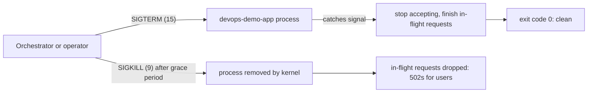

# Module 03: Linux, Shell & Networking Essentials — Handout

## Learning objectives

By the end of this module you should be able to:

- Explain why operations literacy matters for developers, and navigate the standard Linux filesystem layout.
- Inspect processes, explain the difference between SIGTERM and SIGKILL, and describe why graceful shutdown matters for zero-downtime deployments.
- Read and modify Unix permissions, and explain why services should not run as root.
- Compose shell commands with pipes and redirection, use environment variables, and write a defensive shell script with correct exit codes.
- Describe IP addresses, ports, TCP vs UDP, and DNS resolution at a working level; dissect an HTTP exchange with `curl -v`; and explain the difference between binding to `127.0.0.1` and `0.0.0.0`.

## Why developers need ops literacy

You may write code on macOS or Windows, but your service almost certainly *runs* on Linux: the large majority of public cloud workloads and effectively all container platforms are Linux-based. More fundamentally, **containers are Linux**. A Docker container (module 6) is not a lightweight virtual machine — it is an ordinary Linux process isolated with kernel namespaces and resource-limited with cgroups. There is no understanding containers without understanding processes, signals, users, and ports; and Kubernetes (module 7) is, at bottom, a machine for scheduling Linux processes across a fleet of Linux hosts. Everything in the second half of this course stands on this module.

## The filesystem: one tree, standard rooms

Linux mounts everything into a single tree rooted at `/`, laid out by the Filesystem Hierarchy Standard — which means you can land on an unfamiliar server and know where to look:

| Path | Contents |
| --- | --- |
| `/etc` | System and service configuration files |
| `/var/log` | Logs — the first place to look during an incident |
| `/usr` | Installed programs, libraries, shared data |
| `/tmp` | Scratch space, typically cleared on reboot |
| `/proc` | A virtual filesystem: the kernel's live view of every process (`/proc/<PID>/status`, `/proc/<PID>/environ`) |
| `/home` | Users' home directories |

The deeper Unix idea is that *everything is a file*: processes, devices, even kernel tunables are exposed as file-like objects you can read with ordinary tools. This pays off later — a container's memory limit in module 6 is literally a value in a file under `/sys/fs/cgroup`.

## Processes and signals

Every running program is a **process**, identified by a numeric **PID**, owned by a user, and holding a pointer to its **parent** (PPID). The tree roots at PID 1 — `systemd` on modern distributions, or, notably, *your application* inside a container. Inspect processes with `ps aux` (everything, with owner, CPU, and memory), `ps -ef | grep node` (find yours), and `top` or the friendlier `htop` for a live view.

**Signals** are the kernel's asynchronous messages to processes. The two that matter most operationally:

- **SIGTERM (15)** — "please shut down." The default signal sent by `kill <PID>`, by Docker on `docker stop`, and by Kubernetes when it terminates a pod. A process can *catch* SIGTERM and clean up: stop accepting new work, finish in-flight requests, flush buffers, exit.
- **SIGKILL (9)** — "die immediately." Sent by `kill -9`. It cannot be caught, blocked, or handled; the kernel simply removes the process. In-flight requests are dropped and half-written state is abandoned. It is the last resort for a hung process, not a routine tool.

Also worth knowing: **SIGINT (2)** is what Ctrl+C sends, and **SIGHUP (1)** historically meant "terminal closed" and is often repurposed as "reload configuration."

Why this matters: **graceful shutdown** is the difference between a zero-downtime deployment and a spray of user-facing errors on every release. Kubernetes sends SIGTERM, waits a grace period (30 seconds by default), then SIGKILLs whatever remains — so an app that handles SIGTERM exits cleanly, and one that ignores it gets shot mid-request. The course sample app already does the right thing in `server.js`:

```javascript
process.on('SIGTERM', () => {
  console.log('SIGTERM received, shutting down');
  server.close(() => process.exit(0));
});
```

`server.close()` stops the listener while allowing active requests to complete. In lab 03 you will send both signals to the running app and observe the difference directly.



## Users, permissions, and why root is dangerous

Every file has an owner, a group, and a permission string of three triads — **r**ead (4), **w**rite (2), e**x**ecute (1) — for owner, group, and everyone else. `-rwxr-x---` therefore means: a regular file, owner may read/write/execute, group may read/execute, others get nothing; in octal, `750`. Change permissions with `chmod` (`chmod +x script.sh`, `chmod 644 config.yml`) and ownership with `chown alice:devs file`. On a directory, `x` means "may enter/traverse." `sudo` runs a single command as **root** (UID 0), who bypasses permission checks entirely.

A process carries its user's permissions, which is why services should run as unprivileged users: a compromised process running as root owns the whole machine, while a compromised process running as `appuser` is boxed into whatever `appuser` can touch. This is the **principle of least privilege**, and it foreshadows container hardening — Docker containers run as root *inside the container* by default, and one of the first things module 6 and module 12 fix is adding a non-root user. A related fact that explains a pattern you have already seen: binding ports below 1024 requires root (or a special capability), which is one reason applications listen on 3000 or 8080 and let a reverse proxy or load balancer own 80/443.

## The shell: composition, environment, scripts

The daily-driver commands: `cd`, `ls -la`, `cat` (print a file), `less` (page through a big one — `q` quits, `/` searches), `tail -f` (follow a growing log live), `grep` (filter lines; `-r` for recursive, `-i` for case-insensitive, `-v` to invert), and `find . -name "*.log"` (locate files). During an incident, `tail -f app.log | grep ERROR` is the classic combination.

**Pipes and redirection** compose these small tools. `>` sends stdout to a file (overwriting), `>>` appends, `2>` redirects stderr, and `2>&1` merges stderr into stdout — a distinction that matters in CI (module 4), where a script that hides its errors fails silently. The pipe `|` connects one command's stdout to the next command's stdin, and `xargs` turns piped lines into command arguments: `find . -name "*.log" | xargs grep -l ERROR` lists which log files contain errors. The Unix philosophy — small single-purpose tools composed into flows — is the delivery-pipeline idea in miniature.

**Environment variables** are the standard configuration channel for modern apps. `export PORT=4000` sets a variable for the current shell and every child process; the prefix form `PORT=5000 node server.js` sets it for one command only. The sample app reads `process.env.PORT` precisely so the *same code* can run on different ports in dev, CI, and production — the twelve-factor configuration principle that module 9 develops fully. `PATH` is the colon-separated list of directories the shell searches for commands; `which node` tells you which binary will actually run.

**Shell scripts** automate what you would otherwise type. The defensive skeleton used in this course:

```bash
#!/usr/bin/env bash
set -euo pipefail
```

The shebang line selects the interpreter; `set -e` aborts on any command failure, `-u` errors on undefined variables (catching typos), and `-o pipefail` makes a pipeline fail if *any* stage fails rather than only the last. Always quote variable expansions (`"$URL"`) so values with spaces do not split. Control flow is ordinary: `if`/`then`/`fi`, `for x in ...; do ...; done`.

**Exit codes** are the contract that makes automation possible: every command exits with a code, `0` meaning success and anything else meaning failure. `echo $?` shows the last command's code; `a && b` runs `b` only if `a` succeeded; `a || b` only if it failed. Every tool in the rest of this course — GitHub Actions steps, Docker `HEALTHCHECK`, Kubernetes probes — ultimately asks one question: *was the exit code zero?* The flag `curl -f` bridges HTTP into this world by returning a non-zero exit code on 4xx/5xx responses, which is exactly how lab 03's health check script works.

## Networking essentials

**IP addresses and ports.** An IP address identifies a host; a port (1-65535) identifies a specific service on it — street address and apartment number. `127.0.0.1` (hostname `localhost`) is the loopback address meaning "this machine." Only one process can bind a given port/interface pair, which is where lab 01's `EADDRINUSE` error came from.

**TCP vs UDP.** TCP establishes a connection with a handshake and guarantees ordered, complete delivery, at the cost of latency and state — it carries HTTP(S), SSH, and database protocols. UDP is connectionless fire-and-forget: minimal overhead, no delivery guarantee — it carries DNS queries, metrics protocols like statsd, and streaming media. Debugging heuristic: TCP failures look like timeouts and connection resets; UDP failures look like silent loss.

**DNS.** Names resolve to addresses through a chain: local cache, then the configured resolver (see `/etc/resolv.conf`), then recursive lookups to authoritative servers. Inspect with `dig example.com` (or `dig +short example.com` for just the answer; `nslookup` is the older alternative). Each record carries a **TTL** controlling how long resolvers cache it — the reason DNS changes "take time to propagate," and a reason deploy-day cutovers plan around TTLs. Kubernetes gives every service an internal DNS name (module 7), so resolution skills are not just internet trivia. The SRE meme "it's always DNS" exists because an outsized share of mysterious outages trace back to name resolution.

**HTTP anatomy.** `curl -v` prints the entire exchange: request lines prefixed `>` (method, path, `Host` and other headers) and response lines prefixed `<` (status line, headers), followed by the body. Methods are GET, POST, PUT, PATCH, DELETE, HEAD. Status codes group into classes, and the first digit tells you whose problem it is: **2xx** success (200, 201, 204), **3xx** redirection (301, 302, 304), **4xx** client error — fix the request (400, 401, 403, 404, 429), **5xx** server error — fix the server (500, 502, 503). Note that 502/503 typically come from a proxy or load balancer fronting a dead or restarting backend — precisely what a botched graceful shutdown produces, and what module 11's monitoring alerts on.

**localhost vs 0.0.0.0 — the container trap.** A server that binds `127.0.0.1` accepts connections *only from the same machine*; one that binds `0.0.0.0` listens on all network interfaces. This distinction becomes critical in module 6: inside a container, `127.0.0.1` means "this container," so an app bound to loopback is unreachable from the host — the most common "my Docker container doesn't work" bug in existence. The sample app is safe because Node's `server.listen(PORT)` without a host argument binds all interfaces, but several popular dev servers default to loopback and will bite you.

**Who is listening, and SSH.** `lsof -i :3000` shows which process owns port 3000 (works on macOS and Linux); `ss -tlnp` lists all TCP listeners on Linux (`netstat -tlnp` is the legacy equivalent). For remote administration, **SSH** provides an encrypted shell (`ssh user@host`); prefer **key authentication** over passwords — generate a keypair with `ssh-keygen -t ed25519`, put the public key in the server's `~/.ssh/authorized_keys` (or your GitHub settings, as you did in lab 02), and keep the private key private. Keys resist brute force and phishing in a way passwords cannot, which is why GitHub and cloud providers default to them.

## Key takeaways

- Production is Linux and containers *are* Linux processes; modules 6-12 assume everything in this module.
- Config lives in `/etc`, logs in `/var/log`, live process state in `/proc`; everything is a file.
- SIGTERM is a catchable request to shut down; SIGKILL is uncatchable removal. Graceful shutdown (which the sample app implements) is what makes zero-downtime deploys possible.
- Run services as unprivileged users; least privilege limits the blast radius of a compromise.
- Pipes compose small tools; `set -euo pipefail` makes scripts fail loudly; exit code 0 vs non-zero is the universal contract of automation.
- Know your ports, TCP vs UDP, DNS TTLs, and HTTP status classes; `curl -v` shows the whole protocol; binding `127.0.0.1` vs `0.0.0.0` is the classic container gotcha.

## Further reading

- The Linux Command Line, 2nd ed. — William Shotts (No Starch Press; free at https://linuxcommand.org/tlcl.php)
- Filesystem Hierarchy Standard: https://refspecs.linuxfoundation.org/FHS_3.0/fhs/index.html
- `man 7 signal` — the definitive signal reference (also at https://man7.org/linux/man-pages/man7/signal.7.html)
- Julia Evans — wizard zines on Linux, networking, and debugging (notably "Bite Size Linux" and "Networking! ACK!"): https://wizardzines.com/
- Bash "unofficial strict mode" explained — Aaron Maxwell: http://redsymbol.net/articles/unofficial-bash-strict-mode/
- ShellCheck, a linter for shell scripts (use it on lab 03's script): https://www.shellcheck.net/
- MDN — HTTP overview and status codes: https://developer.mozilla.org/en-US/docs/Web/HTTP/Overview
- curl documentation and everything-curl book: https://everything.curl.dev/
- Node.js docs — `server.listen()` host binding behavior: https://nodejs.org/api/net.html#serverlisten
- OpenSSH key management: https://www.ssh.com/academy/ssh/keygen
