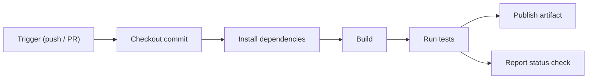

# Module 04: Continuous Integration — Handout

## Learning objectives

After working through this handout you will be able to:

- Define Continuous Integration as a practice and distinguish it from merely operating a CI server.
- Explain why late integration becomes disproportionately expensive ("integration hell").
- Describe the anatomy of a CI pipeline: trigger, checkout, dependencies, build, test, artifact.
- Use GitHub Actions terminology precisely: workflow, event, job, step, runner, action, matrix, cache, secret.
- Configure a workflow that runs tests on every push and pull request, across multiple Node.js versions.
- Integrate CI with branch protection so that a failing check blocks merges.
- Apply fast-feedback principles: short pipelines, fail-fast ordering, and zero tolerance for flaky tests.

## What Continuous Integration actually is

Continuous Integration (CI) is the practice of merging every developer's work into a shared mainline **at least once a day**, with each merge verified by an **automated build and test run**. The definition has two halves and both are load-bearing:

1. **A team habit.** Work is sliced into small changes that land on `main` frequently. Long-lived branches are the enemy.
2. **An automated verification.** Every change — every push, every pull request — triggers a machine that builds the code and runs the tests on a clean environment.

Notice what the definition does *not* say: it never mentions Jenkins, GitHub Actions, or any product. CI is something a team *does*, not something a team *has*. A team with a beautifully configured pipeline and three-week-old feature branches is not doing CI; it is performing a cargo-cult ritual — reproducing the visible artifact (a build server) without the underlying practice (frequent integration). The litmus test is behavioral: does every developer integrate to the mainline daily, and does a red build actually stop the line?

### The cost curve of late integration

Why does the definition insist on "at least daily"? Because the cost of merging grows super-linearly with the time between merges. When two branches diverge for an afternoon, conflicts are trivial and, more importantly, each author still remembers what they changed and why. When branches diverge for a month, you get **integration hell**: dozens of conflicting files, plus *semantic* conflicts that no merge tool can detect — your branch assumes a function signature that the other branch changed, the code merges cleanly, and the tests explode in ways neither branch caused alone.

The non-linearity comes from divergence happening in both directions at once. Each branch invalidates the other's assumptions, so doubling the delay more than doubles the pain. CI's answer is to convert one large, unpredictable, high-stakes merge event into many small, boring ones. In operations, boring is a compliment.

### What a green mainline buys you

- **Fast feedback.** You learn that a change broke something minutes after pushing it, while the context is still in your head.
- **A deployable mainline.** `main` is always in a known-good state — the precondition for Continuous Delivery, which we build in module 10.
- **Courage to refactor.** A trustworthy test suite that runs automatically means you can restructure code without fear of silent regressions.
- **Shared truth.** "Works on my machine" is replaced by "works on the runner" — a neutral, reproducible environment.

## Anatomy of a CI pipeline

Every CI system implements the same skeleton, whatever vocabulary it uses:



1. **Trigger.** An event starts the pipeline: a push, a pull request, a schedule, or a manual click.
2. **Checkout.** The runner fetches the exact commit under verification.
3. **Dependencies.** Libraries and tools are installed from declarations in the repository (`package.json`, lockfiles).
4. **Build.** Compile or bundle. Our zero-dependency Node.js app has no compile step, but the stage exists conceptually.
5. **Test.** The automated suite runs; a non-zero exit code fails the pipeline.
6. **Artifact.** Optionally, the output is packaged and stored for later stages — a topic we return to below.

A crucial property: the pipeline runs on a **clean, disposable machine** every time. There is no leftover `node_modules`, no globally installed tool, no accumulated state. If the pipeline passes, the repository has proven itself self-sufficient — anyone can reproduce the build from the repo alone. Anything the build needs must therefore be declared *in* the repository. This idea reaches its full form in module 6, where containers make the clean environment itself portable.

### The CI server landscape

| Tool | Hosting model | Configuration | Notable traits |
| --- | --- | --- | --- |
| GitHub Actions | SaaS, built into GitHub | YAML in `.github/workflows/` | Zero setup for GitHub repos; huge marketplace |
| GitLab CI | SaaS or self-hosted | `.gitlab-ci.yml` | Deeply integrated into GitLab |
| Jenkins | Self-hosted | Groovy `Jenkinsfile` or UI | Oldest and most extensible; you run the servers |
| CircleCI | SaaS | `.circleci/config.yml` | Early Docker-native support |

The concepts transfer nearly one-to-one: a GitLab "pipeline" is an Actions "workflow"; a Jenkins "stage" resembles a "job". This course uses **GitHub Actions** because your `devops-demo-app` repository from module 2 already lives on GitHub, so there is nothing to install or host.

## GitHub Actions, precisely

Learn this vocabulary exactly — it appears in the quiz and in every job posting.

- **Workflow**: an automated process defined by one YAML file in `.github/workflows/`. A repository can have many.
- **Event (trigger)**: what starts a workflow — `push`, `pull_request`, `schedule` (cron), `workflow_dispatch` (manual), and others.
- **Job**: a set of steps that executes on a single runner. Jobs within a workflow run **in parallel** by default and are isolated from each other.
- **Step**: one unit of work inside a job — either a shell command (`run:`) or a reusable **action** (`uses:`). Steps run **sequentially** and share the job's workspace; the first failing step fails the job.
- **Runner**: the machine that executes a job. GitHub hosts runners (`ubuntu-latest`, `windows-latest`, `macos-latest`); organizations can also register self-hosted runners.
- **Action**: a packaged, reusable step published to the marketplace, such as `actions/checkout@v4` (fetches your code) or `actions/setup-node@v4` (installs a Node.js toolchain). Pin at least the major version.

The workflow you will create in Lab 04:

```yaml
name: CI
on:
  push:
    branches: [main]
  pull_request:

jobs:
  test:
    runs-on: ubuntu-latest
    steps:
      - uses: actions/checkout@v4
      - uses: actions/setup-node@v4
        with:
          node-version: 20
      - run: npm test
```

Why both triggers? `pull_request` runs against a temporary merge of the PR into its base branch — it verifies the change *before* merge. `push` to `main` verifies *after* the merge lands, catching breakage from stacked merges or direct pushes. You almost always want both.

### Matrix builds

A **matrix** expands one job definition across a grid of parameter values:

```yaml
jobs:
  test:
    runs-on: ubuntu-latest
    strategy:
      matrix:
        node-version: [18, 20, 22]
    steps:
      - uses: actions/checkout@v4
      - uses: actions/setup-node@v4
        with:
          node-version: ${{ matrix.node-version }}
      - run: npm test
```

This produces three parallel jobs, one per Node version, and catches "works on 20, breaks on 18" before a user does. Matrices can also span operating systems (`runs-on: ${{ matrix.os }}`) or any custom dimension.

### Caching

Because runners are disposable, dependency installation starts from zero on every run. For dependency-heavy projects that is minutes of wasted time per run. `actions/setup-node` has caching built in:

```yaml
- uses: actions/setup-node@v4
  with:
    node-version: 20
    cache: npm
```

This caches the npm download cache (`~/.npm`), keyed on the hash of `package-lock.json`: unchanged lockfile means cache hit; changed dependencies mean a clean rebuild of the cache. It accelerates installs without compromising the clean-machine guarantee. Our demo app has zero runtime dependencies, so the effect is invisible this week — but the habit pays off immediately on real projects.

### Secrets

Workflows often need credentials — deploy tokens, registry passwords. Never commit them. GitHub stores **secrets** encrypted (repository Settings → Secrets and variables → Actions) and exposes them to workflows as `${{ secrets.NAME }}`. Values are masked as `***` if they appear in logs, though masking is best-effort — an encoded or split secret can still leak, so treat any secret printed to a log as compromised. Note that workflows triggered from forked repositories do not receive secrets, by design. Modules 9 and 12 treat secrets management in depth.

### Status checks and branch protection

Every workflow run reports a **status check** — the green check mark or red X on a commit and its pull request. On its own, a status check is advisory: humans can merge a red PR. The mechanism that gives CI teeth is **branch protection** (which you configured in module 2): mark the CI check as **required**, and GitHub refuses to merge any PR until that check passes. The merge button greys out; no discipline or memory is needed. In Lab 04 you flip this switch on your own repository.

## Fast feedback and pipeline hygiene

**Keep the pipeline under ten minutes.** The value of feedback decays quickly: a failure reported in three minutes is a quick fix within your current mental context; one reported in forty-five minutes interrupts a different task entirely. Speed tactics include dependency caching, running independent jobs in parallel (module 5 splits lint and test into parallel jobs), and moving the very slowest tests into a nightly schedule. The behavioral warning sign that a pipeline is too slow: developers batching up commits "to avoid waiting" — the moment that starts, integration frequency drops and CI erodes.

**Fail fast.** Order steps so cheap checks run before expensive ones — linting (seconds) before tests (minutes) before builds. A job aborts at the first failed step, so early ordering surfaces likely failures sooner. Parallel jobs complement this by delivering all failures at once rather than one per push.

**Flaky tests poison trust.** A flaky test passes or fails without any code change — typically due to timing assumptions, real network calls, or order-dependent shared state. The damage is social rather than technical: red stops meaning "broken" and starts meaning "click re-run", real failures hide in the noise, and eventually the team ignores CI altogether. The only sustainable policy is zero tolerance: a flaky test is fixed or quarantined the day it is detected. Module 5 covers the causes and the quarantine workflow in detail.

**Build once, promote many.** An **artifact** is the pipeline's durable output — a package, a bundle, a container image. A common anti-pattern is rebuilding from source for each environment: once for staging, again for production. Two builds are never provably identical (dependency resolution, timestamps, toolchain drift), so what you tested is not what you shipped. The principle: build the artifact **once**, then *promote* that exact artifact through environments. In module 6 our artifact becomes a Docker image; in module 10, deployment becomes promotion of that image.

**Badges.** A one-line addition to your README renders a live build-status badge:

```markdown

```

It looks cosmetic, but it makes build health ambient information — visible to every visitor without opening the Actions tab, and socially uncomfortable to leave red.

## Key takeaways

- CI = integrate to a shared mainline at least daily + automated build and test on every change. It is a practice; the server merely enforces it.
- Integration cost grows super-linearly with branch lifetime; many small boring merges beat one heroic one.
- Actions hierarchy: workflow → jobs (parallel, isolated) → steps (sequential, shared workspace), executed on disposable runners.
- Trigger on both `pull_request` (gate before merge) and `push` to `main` (verify after).
- Matrix builds multiply a job across versions; caching keeps clean builds fast; secrets stay out of the repo.
- A status check becomes a gate only when branch protection marks it required.
- Under ten minutes, fail fast, zero tolerance for flakes, build once and promote.

## Further reading

- Martin Fowler, [Continuous Integration](https://martinfowler.com/articles/continuousIntegration.html) — the canonical essay defining the practice.
- [GitHub Actions documentation](https://docs.github.com/en/actions) — reference for workflow syntax, events, and runners.
- [Workflow syntax for GitHub Actions](https://docs.github.com/en/actions/writing-workflows/workflow-syntax-for-github-actions) — the full YAML reference used in the lab.
- Jez Humble & David Farley, *Continuous Delivery* (Addison-Wesley, 2010) — chapters 3-5 cover CI and pipeline design; the source of "build once, promote many".
- Nicole Forsgren, Jez Humble & Gene Kim, *Accelerate* (IT Revolution, 2018) — the research linking CI practice to delivery performance (see module 1's DORA metrics).
- [actions/setup-node README](https://github.com/actions/setup-node) — details of the built-in dependency caching.
