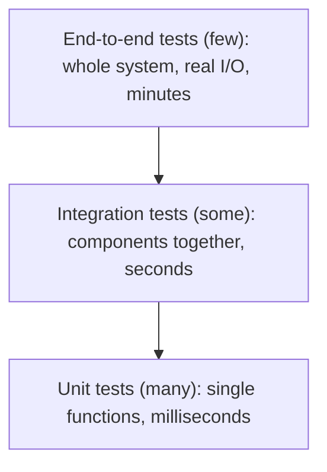

# Module 05: Testing & Quality Gates — Handout

## Learning objectives

After working through this handout you will be able to:

- Explain the test pyramid, the trade-offs between its layers, and why the ice-cream-cone shape is an anti-pattern.
- State the three properties of a good unit test and recognize the common causes of flaky tests.
- Interpret line and branch coverage correctly, and argue why coverage works better as a ratchet than as a target.
- Distinguish linting, type checking, and formatting, and explain what each contributes.
- Define a quality gate and list the gates a service pipeline typically enforces.
- Explain why pre-commit hooks complement but never replace CI enforcement.
- Position code review as the human quality gate alongside the automated ones.

## The test pyramid

Module 4 gave your repository a pipeline that runs `npm test` on every change. That answers *when* and *where* tests run. This module is about *which* tests are worth running — because a green pipeline full of weak checks is a false sense of security with a badge on it.

The **test pyramid** is a model for allocating testing effort across three layers:



- **Unit tests** exercise a single function or module in isolation. They run in milliseconds and, when they fail, point at the exact function that broke. Our `app.test.js` is pure unit testing: it calls `greet()` and `handleRequest()` directly, no HTTP involved.
- **Integration tests** exercise real components together — for a web service, actually starting the server and making a real request over a socket. Slower, but they catch failures at the seams that unit tests structurally cannot see.
- **End-to-end (E2E) tests** drive the whole system the way a user would. Highest realism, highest cost: minutes per test, brittle against unrelated changes, and a failure tells you *something* broke without saying what.

The pyramid's shape encodes economics: you want most of your confidence to come from the cheap, fast, precise layer, with progressively fewer tests as cost rises. The inverted shape — the **ice-cream cone**, with a fat top of manual and E2E tests over a thin sliver of unit tests — emerges from reasonable-sounding decisions ("just test through the UI, that's what users see") and ends with a 45-minute suite where one UI change breaks thirty tests. A cone-shaped suite cannot deliver module 4's ten-minute feedback loop no matter how good the CI server is. The fix is always to push tests down the stack.

### What makes a good unit test

Three adjectives, all mandatory:

- **Fast**: milliseconds each, so thousands run in seconds and nobody hesitates to run them.
- **Isolated**: no network, no disk, no database, no state shared with other tests. Isolation is what makes failures attributable.
- **Deterministic**: the same code yields the same result on every run, on every machine.

Testability is an architecture property. Our sample app separates `app.js` (logic) from `server.js` (HTTP wiring) precisely so the logic can be tested without opening sockets. When code is hard to unit test, that is usually feedback about the design, not about the testing framework.

### Integration and smoke tests for services

Notice what our unit suite never does: it never actually starts the server. `server.js` could fail on startup — a bad import, a port conflict, broken wiring between the request handler and the HTTP layer — and the unit suite would stay green. A **smoke test** closes that gap with minimal machinery: start the service, hit one endpoint, expect success.

```bash
node server.js &
curl --fail http://localhost:3000/health
# {"status":"ok","uptimeSeconds":0}
```

The `/health` endpoint exists for exactly this purpose, and this is only its first appearance: Docker health checks probe it in module 6, and Kubernetes liveness and readiness probes use it in module 7. In Lab 05 this smoke test becomes a CI step.

### Flaky tests and the quarantine strategy

A **flaky test** passes or fails without any code change. The recurring causes:

- **Time**: assertions involving `Date.now()`, sleeps, or timeouts tuned to a fast development laptop that a loaded CI runner misses.
- **Network**: calling real external services that are occasionally slow, rate-limited, or down.
- **Order-dependence**: test B only passes if test A ran first and left state behind. Our own app contains the trap in miniature: `requestCount` in `app.js` is module-level state shared across every test in the process, so a test asserting an exact request count works alone and fails inside the full suite.

Module 4 established why flakes are lethal: they retrain the team to treat red as "click re-run," and real failures then hide in the noise. The sustainable response is the **quarantine strategy**: (1) *detect* — the first time a test fails and a re-run passes, flag it; (2) *quarantine* — remove it from the blocking suite immediately, with a tracking ticket; (3) *fix or delete* within a fixed budget, say one week. The ticket and the deadline are what distinguish quarantine from silently skipping tests forever. What you must not do is configure CI to auto-retry failures until they pass as a permanent policy — that institutionalizes nondeterminism instead of eliminating it.

## Code coverage: measurement without worship

**Line coverage** is the percentage of source lines executed at least once during the test run. **Branch coverage** is stricter: the percentage of decision outcomes taken — for every `if`, did the tests exercise both the true and the false path? The difference matters. Call `greet('Ada')` and nearly every line of `greet` executes, but the `!name` guard branch never fires: line coverage looks healthy while branch coverage exposes the untested path.

Understand what coverage can and cannot tell you:

- **High coverage does not mean good tests.** A test that calls `handleRequest('/')`, `handleRequest('/health')`, and `handleRequest('/nope')` and asserts nothing achieves excellent coverage and verifies precisely nothing. Coverage counts execution, not checking.
- **Low coverage does mean something.** Code with zero coverage has never run under any test — an objective, actionable fact.

Coverage, in other words, is a **gap detector**, not a quality certificate. This is also why **100% is a vanity target**: reaching it forces tests onto trivial and defensive code, and — per Goodhart's law, *when a measure becomes a target, it ceases to be a good measure* — teams under a coverage mandate start writing assertion-free tests to move the number. The healthier pattern is the **ratchet**: measure today's honest coverage (say 72%), fail CI below that floor, and raise the floor as genuine tests land. A ratchet prevents regression without incentivizing junk, because nobody games a floor they already clear.

Node.js ships an experimental coverage reporter in its built-in test runner, so we need no additional tooling:

```bash
node --test --experimental-test-coverage
```

```text
ℹ start of coverage report
ℹ file        | line % | branch % | funcs % | uncovered lines
ℹ app.js      |  96.87 |    92.31 |  100.00 | 26-27
ℹ app.test.js | 100.00 |   100.00 |  100.00 |
ℹ end of coverage report
```

The `uncovered lines` column is the actionable part: it turns an abstract percentage into a reading list. (Try predicting before the lab which lines of `app.js` are uncovered — no current test requests `/metrics`.)

## Static analysis, linting, and formatting

**Static analysis** examines source code without executing it. Where tests verify behavior on the paths you exercised, static analysis verifies structure on *every* path — including error handlers no test has ever reached. The family includes:

- **Linters** such as ESLint: detect bug patterns and suspicious constructs.
- **Type checkers** such as TypeScript's `tsc`: static analysis specialized in type errors. If you have used TypeScript, you have been running static analysis all along.
- **Security scanners**: detect known-vulnerable dependencies and dangerous patterns — these join our pipeline in module 12.

Each ESLint rule encodes a class of bug the community has learned to fear. Three we enable in the lab:

```javascript
const unused = computeExpensiveThing();  // no-unused-vars: dead code or a typo

if (count == '3') { /* ... */ }          // eqeqeq: '3' == 3 is true; coercion bites

let name = 'Ada';                        // prefer-const: never reassigned —
return greet(name);                      // declare the intent
```

Modern ESLint uses **flat config**: a single `eslint.config.js` exporting an array of configuration objects. Older tutorials show `.eslintrc.*` files; the lab uses the current format.

**Formatting is a different job.** A linter judges correctness and quality; a formatter (Prettier being the standard) mechanically normalizes layout — quotes, line width, wrapping. The killer feature of auto-formatting is social: it ends **bikeshedding**, the phenomenon where trivial decisions attract endless debate precisely because everyone is qualified to have an opinion. Once a formatter reformats on save and CI verifies it, no style argument can occur in code review, and reviewer attention is spent where it belongs — on logic and design.

## Quality gates

A **quality gate** is an automated check that must pass before a change proceeds. Three properties define it:

1. **Automated** — a machine evaluates it identically every time.
2. **Enforced** — failure blocks the merge; on GitHub, this is a required status check (module 4's lever, reused).
3. **Objective** — the pass/fail criterion is explicit and visible.

A convention that a human can waive under deadline pressure ("we usually run the linter") is a custom, not a gate — and customs lose to deadlines every time. The point of a gate is removing discretion from the path to `main`.

The gates this course assembles around our app:

| Gate | Mechanism | Module |
| --- | --- | --- |
| Tests pass | `node --test` in CI | 4 |
| Lint clean | ESLint job in CI | 5 |
| Service boots and responds | Smoke test against `/health` in CI | 5 |
| Coverage above threshold | Coverage ratchet | 5 (concept) |
| No high-severity vulnerabilities | Dependency and image scanning | 12 |

### Pre-commit hooks versus CI

Git can run scripts at commit time (**pre-commit hooks**), and tools like Husky and pre-commit make this convenient — lint the staged files, reformat, reject the commit on failure. Hooks give the fastest possible feedback: seconds, before a commit even exists. Use them.

But understand their limits. Hooks run on the developer's machine, where configuration drifts; and any developer can bypass them with `git commit --no-verify`. Anything skippable is a courtesy, not a gate. The architecture that works is **defense in depth**: hooks (and editor integration) catch problems early for speed; **CI is the source of truth**, running the same checks in a controlled environment where required status checks make them unskippable. Never let "we have hooks" substitute for CI enforcement.

### Code review: the human gate

Your repository has required human review since module 2. Machines and humans should check different things. Machines are tireless and pedantic: tests, lint, formatting, coverage. Humans judge what machines cannot: is the design right, are the names honest, should this change exist at all — and review doubles as knowledge sharing. Every check you automate frees reviewer attention for those questions. A reviewer commenting on missing semicolons is not being thorough; they are doing a linter's job at a senior engineer's hourly rate, and that is a process failure.

## Key takeaways

- Shape the suite like a pyramid: many fast unit tests, some integration, few E2E. The ice-cream cone destroys feedback speed.
- Good unit tests are fast, isolated, deterministic. Flakes come from time, network, and order-dependence — quarantine them the day they appear, with a ticket and a deadline.
- Branch coverage beats line coverage; coverage is a gap detector; enforce it as a ratchet and never chase 100%.
- Lint for correctness, format for layout; automation of both upgrades code review.
- A quality gate is automated, enforced, and objective. Hooks are fast courtesy; CI is the authoritative gate.
- After Lab 05 your pipeline runs parallel `lint` and `test` jobs, smoke-tests the running service, and both checks are required.

## Further reading

- Martin Fowler (site), [The Practical Test Pyramid](https://martinfowler.com/articles/practical-test-pyramid.html) — the standard treatment, by Ham Vocke.
- Martin Fowler, [Eradicating Non-Determinism in Tests](https://martinfowler.com/articles/nonDeterminism.html) — the canonical essay on flaky tests.
- [ESLint documentation: Configuration Files](https://eslint.org/docs/latest/use/configure/configuration-files) — flat config reference used in the lab.
- [Node.js test runner documentation](https://nodejs.org/api/test.html) — including `--experimental-test-coverage`.
- [Prettier: Why Prettier?](https://prettier.io/docs/why-prettier) — the case for ending style debates mechanically.
- Google, *Software Engineering at Google* (O'Reilly, 2020; free online) — chapters 11-14 on testing culture, flaky tests, and larger testing.
