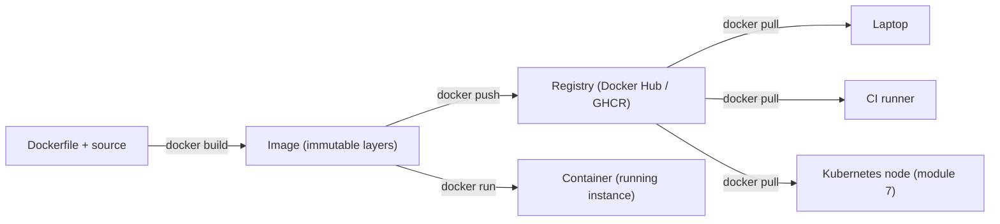

# Module 06: Containers with Docker — Handout

## Learning objectives

After working through this handout you will be able to:

- Explain the "works on my machine" problem and how containers eliminate dependency drift.
- Contrast virtual machines and containers, referring to kernel sharing, namespaces, and cgroups.
- Distinguish images from containers, and explain layers, layer caching, and why Dockerfile instruction order matters.
- Read and write the core Dockerfile instructions, including the difference between `CMD` and `ENTRYPOINT` and between `EXPOSE` and `-p`.
- Apply image hygiene: `.dockerignore`, small base images, multi-stage builds, non-root users, and SHA-based tagging.
- Operate containers with `docker run`, `logs`, `exec`, and `stop`, and explain why the app must bind `0.0.0.0`.
- Define a service with a health check in Docker Compose and explain container ephemerality and volumes.

## The problem: dependency drift

Your pipeline from modules 4-5 verifies every change: tests on three Node versions, lint, and a live smoke test. But a verified commit still has to run somewhere, and that somewhere has its own Node version, OS packages, environment variables, and accumulated manual fixes. Environments diverge silently — nobody decides to let a staging server drift from production; it happens through unrelated upgrades and 2 a.m. hotfixes. The result is the oldest bug report in the industry: *works on my machine*.

Traditional remedies — setup wikis, install scripts, "golden" VM images — all decay, because nothing enforces them. Containers take a different approach: package the application **together with its entire userspace environment** (runtime, libraries, filesystem, configuration defaults) into a single immutable artifact that runs identically on a laptop, in CI, and in production. The environment stops being documentation and becomes a build product under version control.

## VMs versus containers

A virtual machine virtualizes **hardware**: each VM boots a full guest operating system with its own kernel on top of a hypervisor. A container virtualizes the **operating system**: all containers on a host share the host's kernel, and isolation is provided by two kernel features:

- **Namespaces** control what a process can *see*: its own process tree (your app is PID 1 inside), its own network stack, its own filesystem mounts and hostname.
- **cgroups** (control groups) limit what a process can *use*: CPU shares, memory ceilings, I/O bandwidth.

A container is therefore not a lightweight VM — it is an ordinary, isolated *process* on the host. No hardware is emulated and no guest kernel boots, which is why containers start in milliseconds rather than minutes, weigh megabytes rather than gigabytes, and pack hundreds to a host rather than handfuls. (Docker Desktop on macOS and Windows runs a hidden Linux VM to supply that shared kernel — containers are a Linux kernel technology.)

## Images, containers, and registries

An **image** is an immutable template: a layered filesystem plus metadata such as environment variables and the default start command. A **container** is a *running instance* of an image, with a thin writable layer on top. The analogy for developers: image is to container as class is to object, or as program is to process. One image can back any number of simultaneous containers, each with independent state; deleting containers never affects the image.

Images are built as a stack of **layers** — one per Dockerfile instruction. Layers are content-addressed and shared: ten images based on `node:20-alpine` store the base layers exactly once, and pulling an image downloads only the layers you do not already have. Layers are also the basis of build caching, covered below.

A **registry** stores and distributes images. **Docker Hub** is the default public registry (official images like `node`, `nginx`, and `postgres` live there); **GHCR** (GitHub Container Registry, `ghcr.io`) hosts images next to your GitHub repository. The workflow completes module 4's "build once, promote many" principle: CI builds the image once, pushes it to a registry, and every downstream environment — including the Kubernetes cluster in module 7 — pulls and runs that exact artifact.



## The Dockerfile

A Dockerfile is the build recipe for an image. The core instructions:

| Instruction | Effect |
| --- | --- |
| `FROM` | The base image to build upon; always the first instruction. |
| `WORKDIR` | Sets (and creates) the working directory for subsequent instructions. |
| `COPY` | Copies files from the build context into the image. |
| `RUN` | Executes a command at **build** time, producing a new layer. |
| `ENV` | Sets an environment variable, available at build time and runtime. |
| `EXPOSE` | *Documents* the port the app listens on — metadata only, publishes nothing. |
| `USER` | Switches the user for subsequent instructions and for the running container. |
| `CMD` | The default command executed when a container **starts**. |
| `ENTRYPOINT` | The fixed executable; `docker run` arguments are appended to it. |

Two distinctions trip up beginners. First, `RUN` versus `CMD`: `RUN` happens once at build time and its results are baked into a layer; `CMD` happens every time a container starts. Second, `CMD` versus `ENTRYPOINT`: arguments passed to `docker run image ...` **replace** `CMD` entirely, but are **appended** to `ENTRYPOINT`. The common combination sets `ENTRYPOINT` to the program and `CMD` to its default flags. For our app, a plain `CMD` suffices — but use **exec form** (`CMD ["node", "server.js"]`) rather than shell form (`CMD node server.js`). Shell form wraps your command in `/bin/sh -c`, the shell becomes PID 1, and signals such as SIGTERM never reach your process — which would silently break the graceful-shutdown handler in `server.js` and, in module 7, graceful pod termination in Kubernetes.

### Layer caching: order matters

Docker rebuilds a layer only when its inputs change — but a changed layer invalidates **every layer after it**. The optimization rule follows directly: order instructions from rarely-changing to frequently-changing. For a Node.js service the canonical pattern is:

```dockerfile
COPY package.json package-lock.json ./
RUN npm ci --omit=dev
COPY . .
```

Dependency manifests change rarely; source code changes on every commit. With this ordering, editing `app.js` invalidates only the final `COPY . .` — the expensive install layer is served from cache. Reverse the order (`COPY . .` first, then install) and every one-line source edit re-installs all dependencies. Our sample app has **zero runtime dependencies**, so its Dockerfile needs no `RUN npm ci` at all — but Lab 06 keeps the two-step `COPY` structure deliberately, because the habit is what transfers to every real project.

### Hygiene: .dockerignore, size, non-root

`.dockerignore` excludes files from the **build context** — what is sent to the builder and what `COPY . .` can reach. At minimum, exclude `node_modules` (host-installed binaries may not match the image OS), `.git` (history and potential secrets do not belong in an image), and documentation. Smaller contexts also build faster.

Image size hygiene starts with the base: `node:20-alpine` (Alpine Linux, roughly 130 MB) versus `node:20` (Debian-based, roughly 1 GB). For compiled languages and bundled frontends, **multi-stage builds** go further: build in a fat toolchain stage, then `COPY --from=build` only the output into a slim final stage — the compilers never ship. Smaller images pull faster, start faster, and expose fewer packages to vulnerabilities (module 12's scanners will make this concrete).

Finally, containers run as **root by default**. Root inside a container is not root on the host — but if an attacker compromises your app, container isolation is the only wall left, and a runtime or kernel bug turns root-in-container into root-on-host. The Node base images ship an unprivileged `node` user; switching to it costs one line (`USER node`) and nothing at runtime for an app like ours that binds an unprivileged port and writes no system files.

### Tagging strategy

A tag is a **mutable pointer** to an image, not a version. `:latest` is merely the default tag name, and it moves: `myapp:latest` today and tomorrow can be entirely different images. That destroys reproducibility ("what exactly is running in production?") and rollback ("redeploy yesterday's latest" is meaningless). The rule: **never rely on `:latest` in production**. Tag every build with the git commit SHA — `devops-demo-app:3f9c2d1` is forever traceable to an exact commit — optionally alongside a human-friendly semantic version. Immutable, SHA-addressed tags are what make module 10's deployment strategies and instant rollbacks possible: rolling back is just redeploying the previous SHA.

## Running and operating containers

The everyday commands:

```bash
docker run -d --name demo -p 3000:3000 -e PORT=3000 devops-demo-app:v1
docker ps                  # list running containers
docker logs -f demo        # follow stdout/stderr
docker exec -it demo sh    # interactive shell inside the container
docker stop demo           # SIGTERM, grace period, then SIGKILL
```

`-d` detaches (runs in the background); `--name` gives a handle for later commands; `-e` sets environment variables (how configuration reaches containers — module 9 expands on this); `-p host:container` publishes a port. `docker stop` sends SIGTERM first and SIGKILL only after a grace period — with exec-form `CMD`, our app logs `SIGTERM received, shutting down` and exits cleanly.

### Ports, publishing, and 0.0.0.0

A container has its own network namespace, so nothing inside is reachable from the host by default. Two commonly confused mechanisms:

- `EXPOSE 3000` in the Dockerfile is **documentation** — it declares intent and publishes nothing.
- `-p 3000:3000` at run time actually maps a host port to a container port.

And one subtlety from module 3: port mapping delivers traffic to the container's external network interface. A server bound to `127.0.0.1` inside the container is unreachable *even with* `-p` — the classic symptom is a running container that resets every connection from the host. The app must bind `0.0.0.0` (all interfaces). Our `server.js` calls `server.listen(PORT)` with no host argument, which binds all interfaces — safe by default, but many frameworks default to loopback and need explicit configuration in containers.

### Health checks

A running process is not necessarily a working service — it can be deadlocked, out of memory, or failing every request while the process technically exists. A **health check** probes actual behavior on a schedule and surfaces the result (`starting`, `healthy`, `unhealthy`) in `docker ps`. Our `/health` endpoint completes a journey here: written as testable logic (module 5's unit tests), probed by CI's smoke test (module 5), checked by Docker (this module), and consumed by Kubernetes liveness and readiness probes (module 7). One endpoint, four consumers — this is why real services expose health routes.

### Docker Compose

`docker run` with five flags is imperative and unmemorable. **Docker Compose** turns the same information into a declarative, versioned file:

```yaml
services:
  app:
    build: .
    ports:
      - "3000:3000"
    restart: unless-stopped
    healthcheck:
      test: ["CMD", "wget", "-qO-", "http://localhost:3000/health"]
      interval: 10s
      timeout: 3s
      retries: 3
```

`docker compose up -d` brings the stack up; `docker compose ps` shows status including health; `docker compose down` tears it down. Compose's real value appears with multiple services: add a `db:` service and the app can reach it at the hostname `db` on a shared network — a full local stack in one command. Module 11 adds Prometheus and Grafana to this file. Declarative-over-imperative is a theme that culminates in Kubernetes (module 7) and Terraform (module 8).

### Ephemerality and volumes

A container's writable layer **dies with the container**: `docker rm` deletes everything the container wrote. This is a feature — containers are *cattle, not pets*, freely restartable and replaceable, which is exactly the property Kubernetes exploits when it reschedules workloads. The design consequence: anything worth keeping must live outside the container. **Volumes** are Docker-managed persistent storage mounted into a container (`volumes: - dbdata:/var/lib/postgresql/data` for a database service); they survive container removal. Our demo app is deliberately stateless — no volumes required — and stateless services are the easy case for every deployment strategy in this course. State belongs in databases, which bring their own operational chapter.

## Key takeaways

- Containers package the app with its userspace, eliminating dependency drift; isolation comes from namespaces (visibility) and cgroups (resources) over a shared kernel — a container is an isolated process, not a small VM.
- Image = immutable layered template; container = running instance with a writable layer; registries distribute images, completing build-once-promote-many.
- Order Dockerfile layers from stable to volatile; dependency install before source copy. Use exec-form `CMD` so signals reach your process, and `USER node` to drop root.
- `EXPOSE` documents; `-p` publishes; the app must bind `0.0.0.0` inside containers.
- Tags are mutable pointers: tag with the git SHA, never trust `:latest` in production.
- Health checks verify behavior, not existence. Compose declares the local stack. Containers are ephemeral — persistent state goes in volumes or external services.

## Further reading

- [Docker overview — official documentation](https://docs.docker.com/get-started/overview/) — architecture: client, daemon, images, registries.
- [Dockerfile reference](https://docs.docker.com/reference/dockerfile/) — every instruction, precisely specified.
- [Docker build cache — best practices](https://docs.docker.com/build/cache/) — layer caching mechanics and ordering guidance.
- [Docker Compose specification](https://docs.docker.com/compose/compose-file/) — the full compose file format, including `healthcheck`.
- [Docker security — official documentation](https://docs.docker.com/engine/security/) — namespaces, cgroups, and why non-root matters.
- [Working with the Container registry — GitHub Docs](https://docs.github.com/en/packages/working-with-a-github-packages-registry/working-with-the-container-registry) — pushing images to GHCR, used in the lab's stretch goal.
- Adrian Mouat, *Docker: Up & Running* / [*Using Docker*](https://www.oreilly.com/library/view/using-docker/9781491915752/) (O'Reilly) — a thorough book-length treatment of images, builds, and operations.
