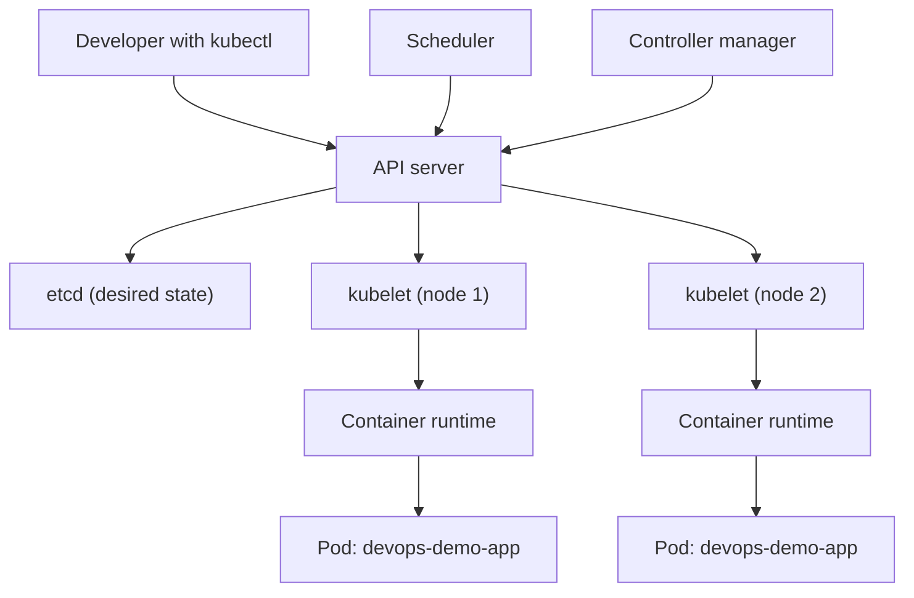

# Module 07: Container Orchestration with Kubernetes — Handout

## Learning Objectives

After working through this handout you will be able to:

- Explain why running containers at scale requires an orchestrator, and name the five problems orchestration solves.
- Describe the Kubernetes architecture at a working level: what the control plane components and node components each do.
- Explain the declarative model and how reconciliation loops turn desired state into actual state.
- Define and relate the core objects: Pod, ReplicaSet, Deployment, Service, and Namespace.
- Choose between liveness and readiness probes and predict what happens when each fails.
- Set resource requests and limits correctly and explain the consequences of exceeding each.
- Use the essential `kubectl` commands to deploy, inspect, scale, update, and roll back an application.

## From One Container to a Fleet

In module 6 you packaged `devops-demo-app` into an image and ran it with `docker run` and Docker Compose. That workflow is genuinely production-adjacent — for a single machine. The moment a service matters, new questions arrive that Docker alone does not answer:

- **Scheduling.** You have ten machines and forty containers. Which container runs where? What happens when a machine fills up, or dies?
- **Self-healing.** A container crashes at 3 a.m. Who restarts it? A cron job full of `docker ps` greps is not an answer you want to maintain.
- **Scaling.** Traffic triples during a launch. You need to go from 3 replicas to 15, across machines, and back down afterwards.
- **Service discovery.** Container IPs change on every restart. How does the frontend find the API without hard-coding addresses?
- **Rollouts.** You need to ship `v2` without downtime, and to get back to `v1` in seconds when `v2` misbehaves.

Kubernetes answers all five with a single idea: you *declare* the state you want, and the cluster continuously works to make reality match. This is the same declarative philosophy you will meet again in module 8 (Terraform for infrastructure) and module 10 (GitOps for deployments).

## Architecture at a Working Level

A Kubernetes cluster is a set of machines presented as one pool of compute. The machines play two roles.

The **control plane** is the brain. It consists of:

- The **API server**, the front door for every request. `kubectl`, controllers, and kubelets all talk to it and to nothing else. It validates objects and persists them.
- **etcd**, a distributed key-value store that holds the entire cluster state — every object you have ever applied. It is the single source of truth.
- The **scheduler**, which watches for Pods that have no assigned node and picks one for each, based on resource requests, node capacity, and placement constraints.
- The **controller manager**, which runs the reconciliation loops: the ReplicaSet controller, the node controller, the Deployment controller, and dozens more.

**Worker nodes** are the muscle. Each node runs:

- The **kubelet**, an agent that watches the API server for Pods assigned to its node and instructs the container runtime to make them real, then reports status back.
- A **container runtime** (containerd or CRI-O) that actually pulls images and runs containers. Your Docker-built images run unchanged because everything speaks the OCI image standard.
- **kube-proxy**, which programs network rules on the node so that traffic sent to a Service's virtual IP reaches a healthy backing Pod.



Notice the shape: everything flows through the API server. You never SSH into nodes to start containers; you change desired state, and the machinery converges on it.

## The Declarative Model and Reconciliation

An imperative system executes your commands in order: "start container A on machine 1." A declarative system accepts a description of the end state: "three replicas of this Pod must always exist." The difference sounds philosophical but is intensely practical.

Every controller in Kubernetes runs the same loop, forever:

1. **Observe** actual state (how many matching Pods exist right now?).
2. **Compare** with desired state (the manifest says `replicas: 3`).
3. **Act** to close the gap (create one Pod, or delete one).

Because the loop never stops, the system is self-healing by construction. Delete a Pod and the ReplicaSet controller notices the count is 2, not 3, and creates a replacement — typically within seconds. Nobody is paged; no script runs; the loop just does its job. Scaling is the same loop with a different target number. Rolling updates are the same loop applied to two ReplicaSets at once. Once you see reconciliation, you see it everywhere in Kubernetes.

## Core Objects, Precisely

**Pod.** The smallest deployable unit: one or more containers that share a network namespace (they reach each other on `localhost`) and can share volumes. Why not schedule bare containers? Because real workloads sometimes need a tightly coupled helper — a log shipper, a TLS proxy — co-located with the app. Most Pods hold exactly one container. Pods are ephemeral: they are replaced, never repaired, and their names and IPs are disposable. You will almost never create a Pod directly.

**ReplicaSet.** A controller whose desired state is "N Pods matching this template exist." It provides self-healing and horizontal scaling. You will see ReplicaSets in `kubectl get` output but you will not write them, because Deployments manage them for you.

**Deployment.** The object you actually work with. It wraps ReplicaSets and adds change management. When you update the Pod template (for example, a new image tag), the Deployment creates a *new* ReplicaSet and performs a **rolling update**: scale new up, scale old down, in steps, so capacity never drops to zero. Old ReplicaSets are retained as **revision history**, which makes `kubectl rollout undo` nearly instantaneous — rollback is just re-activating the previous ReplicaSet.

**Service.** Pods change IPs constantly, so clients need a stable address. A Service provides a fixed virtual IP and cluster DNS name, and load-balances across every Pod matching its **label selector**. The three types you must know:

| Type | Reachable from | Typical use |
| --- | --- | --- |
| ClusterIP | Inside the cluster only | Service-to-service traffic (the default) |
| NodePort | Every node's IP, on a port 30000-32767 | Demos, bare-metal ingress |
| LoadBalancer | The internet, via a cloud load balancer | Public endpoints on cloud providers |

Labels and selectors are the wiring of the entire system. A Deployment's Pod template carries labels such as `app: devops-demo-app`; the Service's selector queries for those labels. Nothing refers to anything by name. The most common beginner failure is a selector that matches no Pods: the Service exists, reports no error, and routes no traffic. Check `kubectl get endpoints` when a Service seems dead.

**Namespace.** A virtual partition of the cluster: a scope for names, RBAC permissions, and resource quotas. Teams and environments commonly get their own namespace. System components live in `kube-system`; your work in this course lives in `default`.

## Probes: Readiness vs Liveness

Kubernetes can ask your container two different questions, and confusing them causes real incidents.

- A **readiness probe** asks: *can you serve traffic right now?* While it fails, the Pod is removed from the Service's endpoint list. The container is **not** restarted. This is how slow-starting apps avoid receiving requests before they are ready, and how overloaded Pods can shed traffic temporarily.
- A **liveness probe** asks: *are you alive at all?* When it fails repeatedly, the kubelet **restarts the container**. This recovers deadlocked processes — and, when misconfigured with too-tight timing, produces endless restart loops of perfectly healthy apps.

Our sample app's `GET /health` endpoint, added back in module 3, is exactly what both probes will call in the lab.

## Requests, Limits, and Graceful Shutdown

Every container should declare **resource requests** (the guaranteed minimum; the scheduler uses it to decide placement) and **limits** (the hard ceiling). The enforcement is asymmetric: a container exceeding its CPU limit is *throttled*, while one exceeding its memory limit is *killed* — `kubectl describe pod` will show `OOMKilled`. Requests that are honest about real usage are one of the highest-leverage reliability habits; without them the scheduler is guessing.

Finally, rollouts and scale-downs mean Pods are terminated on purpose, routinely. Kubernetes sends **SIGTERM**, waits for a grace period (30 seconds by default), then sends SIGKILL. An app that ignores SIGTERM drops in-flight requests every single deploy. `devops-demo-app` already handles it — `server.js` closes the HTTP server and exits cleanly — which is why module 3 made you care about signals long before Kubernetes appeared.

## Daily Driving with kubectl

The commands you will use constantly:

```bash
kubectl apply -f k8s/                        # create or update from manifests (idempotent)
kubectl get pods -w                          # list and watch
kubectl describe pod <name>                  # details plus the event log
kubectl logs <pod> -f                        # application output
kubectl exec -it <pod> -- sh                 # shell inside the container
kubectl port-forward svc/devops-demo-app 8080:80
kubectl scale deployment/devops-demo-app --replicas=5
kubectl rollout status deployment/devops-demo-app
kubectl rollout history deployment/devops-demo-app
kubectl rollout undo deployment/devops-demo-app
```

When something is wrong, the debugging order is: `get` (summary), `describe` (events — scheduling failures, probe failures, OOMKills all appear here), `logs` (application output).

For local development you do not need a cloud. **kind** (Kubernetes in Docker) runs each cluster node as a Docker container; **minikube** runs a single-node cluster in a VM or container. Both expose the same Kubernetes API as production clusters. One local gotcha matters: there is no image registry, so locally built images must be loaded into the cluster (`kind load docker-image ...`) and Pods must use `imagePullPolicy: Never` so Kubernetes does not try to pull from Docker Hub.

## Key Takeaways

- Orchestration solves scheduling, self-healing, scaling, service discovery, and rollouts — as system properties, not manual procedures.
- The control plane (API server, etcd, scheduler, controller manager) decides; kubelets and container runtimes on each node execute; everything flows through the API server.
- Kubernetes is declarative: you store desired state, controllers reconcile actual state toward it, forever.
- Deployment manages ReplicaSets, which manage Pods; Services route stable traffic to Pods via label selectors.
- Readiness failures drain traffic without restarts; liveness failures restart the container. CPU over limit throttles; memory over limit kills.
- Handle SIGTERM. Every rolling update terminates Pods on purpose.

## Further Reading

- Kubernetes documentation, "Concepts": https://kubernetes.io/docs/concepts/
- Kubernetes documentation, "Configure Liveness, Readiness and Startup Probes": https://kubernetes.io/docs/tasks/configure-pod-container/configure-liveness-readiness-startup-probes/
- kind quick start: https://kind.sigs.k8s.io/docs/user/quick-start/
- minikube documentation: https://minikube.sigs.k8s.io/docs/
- Brendan Burns et al., "Borg, Omega, and Kubernetes" (ACM Queue): https://queue.acm.org/detail.cfm?id=2898444
- kubectl cheat sheet: https://kubernetes.io/docs/reference/kubectl/cheatsheet/
