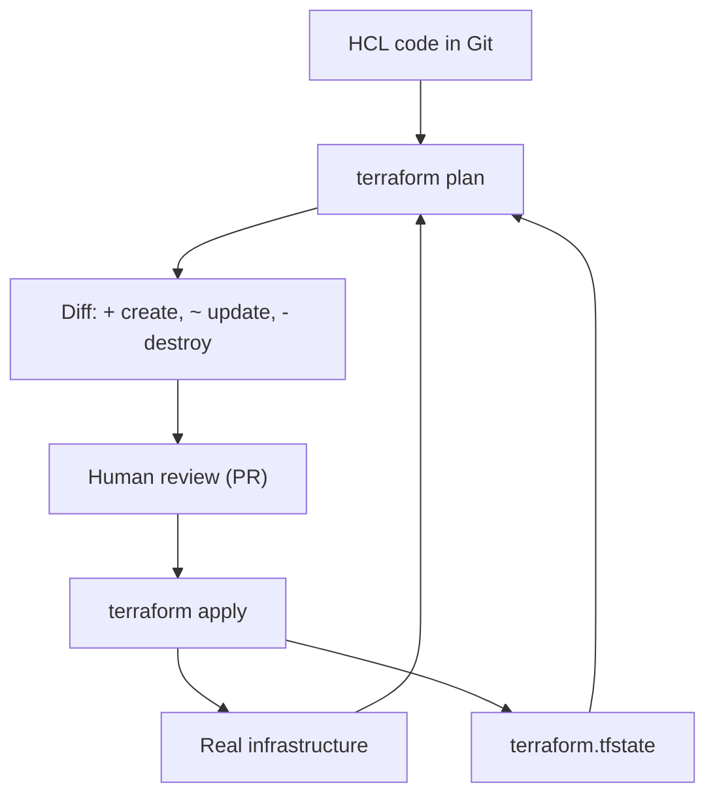

# Module 08: Infrastructure as Code — Handout

## Learning Objectives

After working through this handout you will be able to:

- Explain the failure modes of manual infrastructure management: snowflake servers, configuration drift, and missing audit trails.
- State the core IaC principles — declarative, idempotent, version-controlled, code-reviewed — and recognize them in tooling.
- Distinguish provisioning tools from configuration-management tools and place Terraform, CloudFormation, Pulumi, and Ansible in the landscape.
- Read and write basic Terraform: providers, resources, data sources, variables, and outputs in HCL.
- Run the `init` / `plan` / `apply` / `destroy` workflow and interpret plan symbols (`+`, `~`, `-`, `-/+`).
- Explain what Terraform state contains, why it must not be hand-edited or committed, and how remote backends and locking protect it.
- Detect and heal configuration drift with `plan` and `apply`.

## The Problem: ClickOps

Every infrastructure disaster story starts the same way: someone provisioned something by hand. "ClickOps" — managing infrastructure by clicking through a cloud console or typing one-off commands over SSH — feels fast and is fine for a throwaway experiment. At any real scale it produces three predictable pathologies.

**Snowflake servers.** A snowflake server is unique and unreproducible: built up over years of SSH sessions, emergency hotfixes, and "temporary" tweaks nobody wrote down. You can recognize one by the fear surrounding it — nobody dares to patch it, reboot it, or (worst of all) rebuild it, because nobody knows everything it does. If the machine dies, its configuration dies with it.

**Configuration drift.** Even environments that start identical diverge over time. A hotfix is applied to production during an incident and never backported to staging. A library is upgraded on one node of three. Six months later, "it works in staging" tells you nothing about production, and every deployment is a small act of faith.

**No audit trail.** When infrastructure is mutated by hand, there is no record of who changed the firewall rule, when, or why. Incident postmortems become archaeology. Compliance reviews become guesswork. And disaster recovery — "rebuild the environment from scratch" — becomes a multi-week research project rather than a command.

Infrastructure as Code (IaC) is the systematic fix: describe infrastructure in machine-readable files, store them in version control, and let a tool make reality match the files.

## IaC Principles

Four principles define the practice:

1. **Declarative over imperative.** You describe the end state ("one container, port 3001, attached to this network"), not the sequence of commands to get there. The tool computes the steps. You saw this exact idea in module 7 — a Kubernetes Deployment declares `replicas: 3` rather than scripting three `docker run` calls.
2. **Idempotency.** Applying the same configuration twice must change nothing the second time. This turns "run the script again" from a hazard into a no-op, and makes automation safe to retry.
3. **Version control.** Infrastructure definitions live in Git. Every change has an author, a timestamp, a diff, and a revert path. `git log` becomes your infrastructure audit trail.
4. **Code review.** Infrastructure changes ship through pull requests, reviewed like application code. A firewall opening gets the same scrutiny as a schema migration.

A closely related design choice is **mutable versus immutable infrastructure**, often summarized as *pets versus cattle*. Pets are named, hand-fed, and nursed back to health when sick — the snowflake pattern. Cattle are numbered and replaced when they fail. Immutable infrastructure takes the cattle stance: you never modify a running machine; you build a new image (VM image, container image) and replace the old instance. Drift becomes structurally impossible because nothing is ever changed in place. You already practice this with containers: you never patch a running container, you build `v2` and roll it out.

## The Tool Landscape

One distinction organizes the whole market: **provisioning** versus **configuration management**.

- *Provisioning* tools create the infrastructure itself: networks, virtual machines, Kubernetes clusters, managed databases, DNS records. Terraform and its open-source fork OpenTofu are the cross-platform standard; CloudFormation (AWS) and Bicep (Azure) are vendor-specific equivalents; Pulumi and the AWS CDK let you provision using general-purpose languages such as TypeScript or Python instead of a DSL.
- *Configuration management* tools set up what is inside machines: packages, config files, users, services. Ansible is the most popular (agentless, YAML playbooks); Chef and Puppet preceded it. Module 9 gives Ansible a proper introduction.

The categories compose: a common pattern is Terraform creating a VM and Ansible configuring it. With immutable infrastructure, more of the configuration work moves into image builds, but both categories remain relevant. This course standardizes on Terraform for provisioning; everything below applies equally to OpenTofu, which is a drop-in replacement (`tofu init`, `tofu plan`, ...).

## Terraform Core Concepts

Terraform configurations are written in **HCL** (HashiCorp Configuration Language) in files ending in `.tf`. HCL is built from blocks:

```hcl
terraform {
  required_providers {
    docker = {
      source  = "kreuzwerker/docker"
      version = "~> 3.0"
    }
  }
}

provider "docker" {}

resource "docker_container" "app" {
  name  = "devops-demo-app-tf"
  image = docker_image.app.image_id
  ports {
    internal = 3000
    external = var.external_port
  }
}
```

- A **provider** is a plugin that translates resources into API calls for one platform — AWS, GCP, GitHub, Kubernetes, or (as in our lab) the local Docker daemon. Providers are pinned by source and version and downloaded by `terraform init`; the resolved versions are recorded in `.terraform.lock.hcl`, which you commit so every teammate and CI run uses identical plugins.
- A **resource** is one piece of infrastructure whose full lifecycle Terraform owns: it creates, updates, and destroys it. The two labels are the resource *type* (`docker_container`) and a *local name* (`app`) used for references.
- A **data source** (`data` block) is a read-only lookup of something Terraform does *not* manage — an existing network, an AMI, a DNS zone owned by another team. `resource` means "I own this"; `data` means "I look this up."
- **Variables** parameterize a configuration. Each `variable` block declares a name, type, optional description, and optional default. Values come from (lowest to highest precedence) defaults, a `terraform.tfvars` file, `TF_VAR_*` environment variables, and `-var` command-line flags. Variables are how one codebase serves multiple environments.
- **Outputs** are the configuration's return values — resource IDs, endpoint URLs — printed after `apply` and readable with `terraform output`. Automation downstream consumes outputs instead of guessing names.

References between resources (`docker_image.app.image_id`) do double duty: they pass values *and* declare dependencies. Terraform builds a dependency graph from them and derives the execution order itself — you never write "step 1, step 2."

**Modules** package a directory of `.tf` files into a reusable unit with variables as inputs and outputs as, well, outputs — functions for infrastructure. Teams encode golden patterns ("our standard web service") once and instantiate them everywhere; the public registry at registry.terraform.io offers vetted modules for common shapes. **Workspaces** let one configuration maintain several independent state files (`dev`, `staging`, `prod`); many teams instead prefer one directory per environment composed from shared modules, which makes environment differences explicit. Either way, the principle is the same: every environment is created by the same reviewed code.

## The Workflow and Reading a Plan

```bash
terraform init      # download providers, initialize backend, write lock file
terraform plan      # preview changes without touching anything
terraform apply     # execute (shows the plan again and asks for confirmation)
terraform destroy   # tear down everything the configuration manages
```

`terraform plan` is the heart of the workflow: it compares your code, the state file, and real infrastructure, and prints a diff of what `apply` would do:

| Symbol | Meaning | Risk |
| --- | --- | --- |
| `+` | Resource will be created | Low |
| `~` | Resource will be updated in place | Medium |
| `-` | Resource will be destroyed | High — read carefully |
| `-/+` | Resource will be destroyed and recreated | High — implies downtime or data loss |

Replacement (`-/+`) happens when a change cannot be applied in place — in the lab, changing a container's published port forces replacement, because Docker cannot re-port a running container. The professional habit to build immediately: **read every plan before applying, and scan for `-` first.** In mature teams the plan output *is* the change request that reviewers approve.

## State: Terraform's Memory

After `apply`, Terraform writes `terraform.tfstate`: a JSON document mapping each resource block in your code to the real-world object it created (IDs, attributes, dependencies). State is what makes the diffing possible — without it, Terraform could not know that `docker_container.app` already exists as container `abc123` and would try to create everything again on each run.

State demands hygiene, because getting it wrong hurts:

- **Never hand-edit the file.** A corrupted state can orphan real infrastructure (Terraform forgets it exists) or cause duplicates. For rare surgical operations, use the supported commands: `terraform state list`, `terraform state show <address>`, `terraform state rm`, `terraform state mv`.
- **Never commit state to Git if it can contain secrets — and it usually can.** Provider attributes land in state verbatim: database passwords, access keys, TLS private keys. Your `.gitignore` should contain `.terraform/` (the provider plugin cache) and `*.tfstate*` (state plus its backups).
- **Teams use remote backends with locking.** A state file on one laptop cannot be shared, and two people applying concurrently with a shared file will race and corrupt it. Remote backends (S3 with DynamoDB locking, GCS, Azure Blob, Terraform Cloud) centralize state, serialize applies with a lock, encrypt at rest, and keep versioned history.

State also enables **drift detection**. Drift is any out-of-band change to reality — a console click, a manually deleted container. On the next `plan`, Terraform refreshes state against real infrastructure, notices the discrepancy, and proposes to restore the declared configuration; `apply` heals it. This is the reconciliation idea from module 7 again, with one difference: Kubernetes reconciles continuously, Terraform reconciles when you ask. Many teams run a scheduled `terraform plan` in CI purely as a drift alarm.



## Terraform in CI

Terraform slots into the pipeline discipline you built in modules 4-5. The standard shape:

- **On pull request:** CI runs `terraform plan` and posts the plan as a comment. Reviewers approve an exact, machine-generated description of the change — not a prose promise.
- **On merge to main:** the pipeline runs `terraform apply` with the approved plan. No human applies from a laptop; credentials live in the pipeline, not on workstations.

This makes Git the source of truth for infrastructure, with reality following it — a pattern module 10 will generalize into GitOps for application deployments.

## Key Takeaways

- Manual infrastructure produces snowflake servers, drift, and no audit trail; IaC replaces memory and clicks with reviewable, versioned code.
- IaC is declarative, idempotent, version-controlled, and code-reviewed — the same discipline as application code.
- Provisioning (Terraform) creates infrastructure; configuration management (Ansible) configures what is inside it.
- The workflow is `init` → `plan` → `apply` → (`destroy`); read every plan and scan for `-` and `-/+` before applying.
- State maps code to reality. Never hand-edit it, never commit it, and in teams use a remote backend with locking.
- Drift is detected by `plan` and healed by `apply` — reconciliation on demand.

## Further Reading

- Terraform documentation: https://developer.hashicorp.com/terraform/docs
- OpenTofu documentation: https://opentofu.org/docs/
- kreuzwerker Docker provider (used in the lab): https://registry.terraform.io/providers/kreuzwerker/docker/latest/docs
- Martin Fowler, "SnowflakeServer": https://martinfowler.com/bliki/SnowflakeServer.html
- Martin Fowler, "InfrastructureAsCode": https://martinfowler.com/bliki/InfrastructureAsCode.html
- Kief Morris, *Infrastructure as Code* (O'Reilly) — companion site: https://infrastructure-as-code.com/
- Terraform state documentation: https://developer.hashicorp.com/terraform/language/state
