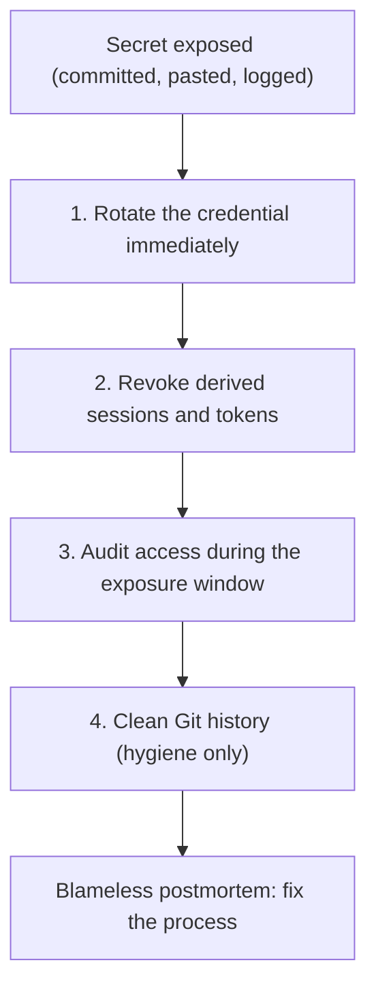

# Module 09: Configuration & Secrets Management — Handout

## Learning Objectives

After working through this handout you will be able to:

- Distinguish configuration from code, apply the 12-factor rule of storing config in the environment, and design sensible config layering.
- Use `.env` files safely and explain why a committed secret must be treated as compromised even after deletion.
- Create and consume Kubernetes ConfigMaps and Secrets, and explain precisely why base64 is not encryption and what hardening Secrets requires.
- Describe what dedicated secret managers add: Vault's central store, dynamic secrets, leases, and audit logging; cloud secret managers; sealed-secrets and SOPS for GitOps.
- Explain secret rotation and execute the correct response when a secret leaks.
- Read and write a basic Ansible playbook, define inventory/playbook/task/module, and explain how ansible-vault protects variables.

## Config vs Code

A useful definition: **configuration is everything likely to vary between deployments** of the same code — the database URL that differs between staging and production, the port the server binds, feature flags, and credentials such as passwords and API tokens. The code is identical everywhere; the config is what makes each environment itself.

The [12-factor app](https://12factor.net/config) methodology gives this a sharp litmus test: *could you open source your codebase right now without compromising any credentials or internal details?* If not, something that is really config is living in code. Factor III prescribes the remedy: **store config in the environment**. Environment variables are language-agnostic, OS-agnostic, trivially injected by every orchestrator you have met so far (Docker, Compose, Kubernetes), and — crucially — impossible to accidentally commit, because they are not files.

Our sample app has followed this rule since module 1:

```javascript
const PORT = process.env.PORT || 3000;
```

That one line also demonstrates **config layering**. A robust application resolves configuration from layers, weakest to strongest:

1. **Defaults in code** — safe values so a fresh clone runs with zero setup (`|| 3000`).
2. **Per-environment configuration** — files or, on Kubernetes, ConfigMaps that differ per environment.
3. **Environment variables injected at deploy time** — the final override.

In the lab you extend the app with a second variable following the same pattern: `const GREETING = process.env.GREETING || 'Hello';`.

## .env Files and Why Git History Is Forever

For local development, `.env` files hold `KEY=value` pairs that tooling loads into the environment. The safe workflow has three parts, in this order:

1. Add `.env` to `.gitignore` *before creating the file*, so there is no window for an accidental commit.
2. Commit a **`.env.example`** containing every variable the app understands, with harmless placeholder values — it doubles as documentation.
3. Each developer copies `.env.example` to `.env` and fills in real values.

Why the paranoia? Because **Git history is forever**. `git rm .env && git commit` removes the file from the working tree, but every clone still contains every commit, and the secret remains one `git show` away. The incident pattern is depressingly repeatable: a credential is committed, the repository is pushed to a public host, and automated scanners — attackers run them continuously against public GitHub — find the key within minutes. Cryptomining bills and data breaches follow. This is why GitHub runs its own secret scanning, and why tools like **gitleaks** exist to scan repositories (and pre-commit hooks) for credential-shaped strings before they escape. You will run gitleaks against your own repository in the lab and watch it catch a planted fake key.

The corollary that matters most: if a real secret was ever pushed, **deleting it is not remediation**. Assume it was harvested and rotate it. More on that below.

## Config and Secrets in Kubernetes

Kubernetes separates the two concerns into two object types.

A **ConfigMap** holds non-secret key-value configuration in the cluster, decoupled from the image:

```yaml
apiVersion: v1
kind: ConfigMap
metadata:
  name: devops-demo-app-config
data:
  GREETING: "Hnamaste"
```

Containers consume it either wholesale with `envFrom` (every key becomes an environment variable) or selectively with `valueFrom`/`configMapKeyRef` (one key, optionally renamed); ConfigMaps can also be mounted as files. Because environment variables are read at container start, changing a ConfigMap requires a rollout restart of the consuming Pods to take effect. Keep ConfigMap manifests in Git — config changes deserve the same review as code changes.

A **Secret** is mechanically almost the same object with a different `kind`, consumed via `secretKeyRef` the same way. The separate type exists so access control can treat it differently. Secrets are conveniently created imperatively so no file with the value ever exists:

```bash
kubectl create secret generic demo-secret --from-literal=API_TOKEN=s3cr3t
```

Now the critical caveat: **Kubernetes Secrets are base64-encoded, not encrypted**. Run `kubectl get secret demo-secret -o yaml` and you will see `API_TOKEN: czNjcjN0`; run `echo czNjcjN0 | base64 -d` and the plaintext falls out. base64 is a transport encoding — reversible by anyone, no key involved. It exists so binary values survive YAML and JSON, not to protect anything. Hardening therefore requires:

- **Encryption at rest** for etcd, so a stolen etcd backup does not contain every secret in plaintext. Managed clusters (GKE, EKS, AKS) generally enable this; self-managed clusters must configure it.
- **RBAC**: restrict `get` and `list` on Secrets to the people and service accounts that need them. Read access to Secrets *is* the plaintext.
- **Least privilege scoping**: each application reads only its own Secrets, in its own namespace.
- And never commit Secret manifests containing real values to Git — that is the `.env` mistake wearing a YAML costume.

## Real Secret Management

Environment variables and Kubernetes Secrets *deliver* secrets to processes; they do not *manage* them. Delivery mechanisms cannot answer: Who accessed this credential and when? How do we rotate it everywhere at once? How do we grant access for an hour instead of forever? Dedicated systems can.

**HashiCorp Vault** is the reference point. Its concepts:

- A **central store**: one encrypted, access-controlled place for all secrets, instead of copies scattered across CI settings, laptops, and YAML.
- **Dynamic secrets**: Vault does not just store credentials — it *creates* them on demand. Ask for database access and Vault mints a fresh database user for you, with the permissions your policy allows.
- **Leases**: every dynamic secret carries a time-to-live. When the lease expires, Vault revokes the credential automatically. A leaked credential that died an hour ago is a non-event — this inverts the economics of leaks.
- An **audit log**: every read and write is recorded. "Who could have known this password?" becomes a query instead of an unanswerable shrug.

Cloud providers offer managed alternatives — **AWS Secrets Manager**, **GCP Secret Manager**, **Azure Key Vault** — which integrate with the platform's IAM, support versioning and (on AWS) automated rotation functions, and require no servers of your own. They are less powerful than Vault (no general dynamic-secrets engine) but drastically simpler to operate, and the pragmatic default for single-cloud teams.

A special problem arises with GitOps (module 10): if Git must be the source of truth for *all* manifests, where do Secrets go? Two established answers commit *ciphertext*:

- **sealed-secrets**: a controller in the cluster holds a private key; you encrypt a Secret with the matching public key using `kubeseal`, and the resulting SealedSecret YAML is safe to commit — only that cluster can decrypt it.
- **SOPS**: encrypts the *values* (not the keys) inside YAML/JSON files using a KMS or age key, so files remain diffable and reviewable while the sensitive parts are ciphertext.

**Rotation** — replacing credentials on a schedule or on demand — limits how long any undetected leak stays exploitable. Ranked by preference: dynamic short-lived credentials (rotation is automatic and constant), automated rotation (e.g. Secrets Manager rotation lambdas), and scheduled manual rotation (calendar-driven and error-prone, but still far better than never). Rotation also exposes hidden coupling: the first rotation ever attempted tends to discover services with the old password hard-coded.

And when a secret leaks, the response order is not negotiable:

1. **Rotate immediately.** The new value invalidates the old. Minutes matter.
2. **Revoke** sessions and tokens derived from the leaked credential.
3. **Audit** what the credential accessed during the exposure window.
4. Only then, clean Git history (`git filter-repo`) — that is hygiene, not remediation, because clones, forks, and scrapers already have the old value. **Purging is never enough.**



## Ansible: The Configuration-Management Complement

Module 8 drew the line: Terraform *provisions* infrastructure into existence; **Ansible** *configures* what runs inside it — packages, files, users, services. Ansible is **agentless**: it connects over SSH (or runs locally) and pushes desired state, so there is nothing to install on the machines it manages. Its vocabulary:

- **Inventory** — the list of hosts to manage (a static file or a dynamic source).
- **Playbook** — a YAML file declaring which hosts get which tasks, in order.
- **Task** — one unit of desired state ("this directory exists", "this package is installed").
- **Module** — the code implementing a task type (`file`, `copy`, `apt`, `service`, ...). (An unfortunate name collision: nothing to do with Terraform modules.)

A realistic small playbook, runnable on your own machine:

```yaml
- name: Configure demo app host
  hosts: localhost
  connection: local
  tasks:
    - name: Ensure config directory exists
      ansible.builtin.file:
        path: /tmp/demo-config
        state: directory
        mode: "0755"

    - name: Write app environment file
      ansible.builtin.copy:
        dest: /tmp/demo-config/app.env
        content: "GREETING=Hello from Ansible\n"
```

Tasks declare state, not actions — "the directory exists", not "run mkdir" — which makes them **idempotent**. The first run reports `changed=2`; the second reports `changed=0`, because reality already matches. That counter is the same reconciliation principle you saw in Kubernetes controllers and `terraform plan`, surfacing in a third tool.

Ansible's answer to the secrets question is **ansible-vault**: it encrypts variable files (or individual values) so playbooks referencing secrets can live in Git while the plaintext does not. `ansible-vault encrypt group_vars/prod/secrets.yml` produces ciphertext; `ansible-playbook site.yml --ask-vault-pass` decrypts at run time. Same theme as SOPS: encrypted at rest, decrypted only at the moment of use.

## Key Takeaways

- Config is what varies between environments. Store it in the environment (12-factor III), with safe defaults in code and env vars as the final override.
- `.gitignore` the `.env` file before it exists; commit `.env.example` instead; run secret scanners like gitleaks. Git history is forever.
- ConfigMaps carry plain config; Kubernetes Secrets are base64-*encoded*, not encrypted — harden with etcd encryption at rest, RBAC, and least privilege.
- Real secret management adds lifecycle: Vault (central store, dynamic secrets, leases, audit log) or cloud secret managers; sealed-secrets and SOPS make GitOps-safe ciphertext.
- When a secret leaks: rotate, revoke, audit — then clean history. Deleting is never enough.
- Ansible configures machines idempotently via inventories, playbooks, tasks, and modules; ansible-vault encrypts its variables.

## Further Reading

- The Twelve-Factor App, Factor III (Config): https://12factor.net/config
- Kubernetes documentation, ConfigMaps: https://kubernetes.io/docs/concepts/configuration/configmap/
- Kubernetes documentation, Secrets: https://kubernetes.io/docs/concepts/configuration/secret/
- Kubernetes documentation, Encrypting Secret Data at Rest: https://kubernetes.io/docs/tasks/administer-cluster/encrypt-data/
- HashiCorp Vault documentation: https://developer.hashicorp.com/vault/docs
- gitleaks: https://github.com/gitleaks/gitleaks
- sealed-secrets: https://github.com/bitnami-labs/sealed-secrets
- SOPS: https://github.com/getsops/sops
- Ansible documentation: https://docs.ansible.com/ansible/latest/getting_started/index.html
- GitHub secret scanning: https://docs.github.com/en/code-security/secret-scanning/about-secret-scanning
