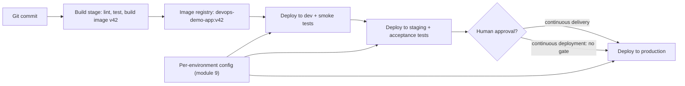

# Module 10: Continuous Delivery & Deployment Strategies — Handout

## Learning objectives

By the end of this module you can:

- State the precise difference between continuous delivery and continuous deployment
- Explain "build once, promote many" and why per-environment rebuilds are dangerous
- Describe the stages of a deployment pipeline and what each stage is for
- Compare recreate, rolling, blue/green, canary, and shadow deployments and choose between them
- Explain `maxSurge` and `maxUnavailable` in a Kubernetes rolling update
- Use feature flags to decouple deployment from release, and manage flag debt
- Apply the expand/contract pattern for zero-downtime database migrations
- Explain GitOps and how pull-based delivery differs from push-based pipelines

## Continuous delivery vs continuous deployment

The two terms are one word apart and constantly confused, but the distinction is sharp.

**Continuous delivery** means every change that passes the pipeline leaves the software in a **releasable** state. Deploying to production is a business decision — a human presses the button, whenever the organization wants. The engineering guarantee is that the button always works.

**Continuous deployment** goes one step further: there is no button. Every change that passes the pipeline is **automatically released** to production, with no human gate. It is a strict superset of continuous delivery — you cannot automate a decision you were not capable of making safely in the first place.

Most organizations practice continuous delivery; a smaller set (with very strong automated testing and observability) practice continuous deployment. Neither is "more correct" — regulated industries, coordinated launches, and app-store review processes are all legitimate reasons to keep a human on the button. What is *not* legitimate is using the button as a substitute for a trustworthy pipeline.

## Build once, promote many

A core rule of continuous delivery: the artifact — for us, the container image `devops-demo-app:<tag>` — is built **exactly once**, early in the pipeline, and then **promoted** unchanged through every environment: dev, staging, production.

Why it matters: if you rebuild per environment, the thing you tested in staging is not the thing running in production. Different dependency resolution at build time, a newer base image pulled from the registry, an environment-specific compile flag — any of these silently invalidates every test result you collected. "It passed staging" only means something if staging and production run the same bytes.

The corollary is that **everything environment-specific must come from outside the artifact**. This is exactly what module 9 built: environment variables, ConfigMaps, and secrets injected at runtime. The image is generic; the environment makes it specific.

The pipeline is a funnel of increasing confidence and increasing cost. The commit stage (your CI from modules 4–5) gives feedback in minutes and should catch the vast majority of defects. Acceptance and staging stages are slower and more production-like. Production deployment is the final stage — and the deployment *strategy* you pick determines how much risk that last step carries.

## Deployment strategies

All strategies answer the same question: **how do you replace version 1 with version 2 while users are watching?**

### Recreate

Stop every v1 instance, then start v2. There is a window with zero instances running — guaranteed downtime. In Kubernetes: `strategy.type: Recreate`.

It sounds primitive, but it is the honest choice when two versions genuinely cannot coexist — for example, an app that takes an exclusive lock or performs an incompatible in-place data migration on startup. For internal tools with tolerant users, a 30-second gap may cost less than the engineering effort to avoid it.

### Rolling update

The Kubernetes default. Pods are replaced a few at a time; old and new versions serve traffic simultaneously during the transition. Two knobs control the pace:

- **`maxSurge`** — how many pods *above* the desired replica count may exist during the rollout. Surge pods are the extra headroom that lets new pods start before old ones stop.
- **`maxUnavailable`** — how many pods *below* the desired replica count are tolerated. Setting it to `0` guarantees full serving capacity throughout the rollout (at the cost of requiring surge room in the cluster).

With `replicas: 4, maxSurge: 1, maxUnavailable: 0`, Kubernetes starts one v2 pod, waits for its readiness probe (module 7) to pass, terminates one v1 pod, and repeats until all four are v2.

Rolling updates protect *capacity*, not *correctness*. If v2 has a subtle bug — a 5% error rate, a latency regression — the rollout will happily deliver it to 100% of users. And because v1 and v2 overlap, every change must be backward compatible with shared state (see expand/contract below).

### Blue/green

Run two complete environments: **blue** (current, v1) and **green** (new, v2). Only one receives traffic. After deploying and verifying green, you flip the router — in Kubernetes, typically by changing a Service's label selector — and 100% of traffic cuts over **instantly**. Rollback is the same flip in reverse, equally instant.

The costs: you run **double capacity** during the window, and the database is normally shared between blue and green, so schema compatibility problems do not disappear. Blue/green suits releases where you want a rehearsed, atomic, instantly reversible cutover.

### Canary

Route a **small fraction** of real production traffic to v2 while the majority stays on v1. Watch the canary's metrics and logs. If it is healthy, shift more traffic (or promote fully); if not, remove it — only a small slice of users ever saw the problem.

The lab implements the simplest Kubernetes form: two Deployments (`track: stable` with 4 replicas, `track: canary` with 1) sharing the label `app: devops-demo-app`. The Service selects only on that shared label, so its endpoints include all 5 pods and roughly 20% of requests hit the canary. The split is coarse — it follows the pod ratio. Service meshes (Istio, Linkerd) and ingress controllers offer per-request percentage control when you need a 1% canary.

The non-negotiable prerequisite: **metrics**. A canary you do not measure is just a slow rollout. You must decide *before* deploying what "healthy" means — error rate, latency, log errors — and actually compare canary against stable. Module 11 provides these tools; today's lab judges the canary by reading logs, and the friction is intentional.

### Shadow (traffic mirroring)

Copy live requests to v2, but serve users only v1's responses. The new version experiences real production traffic with zero user-facing risk — ideal for validating rewrites and performance. The hazards are duplicated side effects (never mirror writes into shared systems naively) and doubled backend load. This is an awareness-level technique in this course.

### Choosing

| Scenario | Reasonable choice | Why |
| --- | --- | --- |
| Internal batch tool, brief downtime fine | Recreate | Simplest thing that works |
| Routine stateless service update | Rolling | Default, cheap, no downtime |
| High-stakes release, rehearsed cutover | Blue/green | Instant flip both directions |
| Risky change, want real-traffic evidence | Canary | Small blast radius, measured |
| Validating a rewrite under real load | Shadow | Zero user risk |

## Feature flags: deploying is not releasing

A feature flag is a runtime conditional that turns code paths on or off without redeploying. It splits two events that traditionally happened together:

- **Deploy** — the code is on the servers (a technical act, low risk with the strategies above)
- **Release** — users can see the feature (a product decision, reversible in seconds)

Flags enable **dark launches** (deploy the code disabled, release later), **targeting** (enable for internal users, then 1%, then 10% — a canary at the feature level rather than the process level), and **kill switches** (a misbehaving feature is turned off in seconds at 3 a.m., no pipeline run required). Flags also support trunk-based development from module 2: unfinished work merges to `main` safely disabled instead of aging on a long-lived branch.

The price is **flag debt**. Every flag doubles the code paths it guards, and stale flags accumulate into untested combinations and dead code that nobody dares delete. Hygiene rules: every flag gets an owner and a removal ticket at creation; the flag and the old code path are deleted once rollout completes; flags older than a quarter get audited. Treat a flag as a temporary release tool, never as permanent configuration.

## Databases: the expand/contract pattern

Every zero-downtime strategy has a hidden assumption: v1 and v2 run **at the same time** against the **same database**. A schema change that is atomic from the database's point of view — renaming `users.name` to `users.full_name` — breaks one version or the other no matter when you run it.

The solution is **expand/contract** (also called parallel change): split every breaking change into backward-compatible steps.

1. **Expand** — add the new column `full_name` (nullable). v1 ignores it; nothing breaks.
2. **Migrate** — deploy v2, which writes *both* columns and reads the new one. Backfill historical rows.
3. **Contract** — once no running code reads `name`, deploy v3 that ignores it, then drop the column.

At every moment, every running version finds the schema it expects, and every step is individually reversible. The same pattern applies to API contracts between services: add the new field, migrate consumers, then remove the old field.

## Rollback vs roll forward

When a deployment goes wrong you have two exits. **Roll back**: redeploy the previous version — `kubectl rollout undo` makes this one command. **Roll forward**: ship a fix on top through the normal pipeline.

Rollback is only trivially safe for stateless changes. Once v2 has *written data in a new shape* — new columns, new formats, new rows — v1 may crash on or corrupt that data, and applied migrations may not be reversible. This is why data makes rollback hard, and why expand/contract matters: during the expand phase, the previous version still works, keeping the rollback window open. Teams with fast pipelines often prefer roll forward precisely because their fix can be in production in minutes; teams should decide the rollback story *before* deploying, not during the incident.

## GitOps: pull-based delivery

GitOps applies a simple rule: the **desired state** of every environment — all the Kubernetes manifests — lives in a Git repository, and an **agent running inside the cluster** (Argo CD and Flux are the leading implementations) continuously compares the desired state against the actual cluster state and converges them.

This inverts the classic push model, where a CI job runs `kubectl apply` against the cluster:

- **Credentials**: in push mode, the CI system holds deploy credentials to every cluster — a large attack surface. In pull mode, the agent inside the cluster only needs read access to a Git repo; cluster credentials never leave the cluster.
- **Drift**: push pipelines deploy and forget. If someone hand-edits the cluster (`kubectl edit`), nothing notices. A GitOps agent detects the drift and reverts it, keeping Git authoritative.
- **Audit and rollback**: the deployment history is `git log`; rolling back an environment is `git revert`.

You have practiced manual GitOps since module 7: your `k8s/` directory in Git *is* the desired state, and you have been the reconciliation agent running `kubectl apply`. Argo CD and Flux simply automate you away.

## Release trains vs on-demand

A **release train** ships on a fixed schedule — "every Tuesday" — and changes that miss the train catch the next one. Trains give predictability for coordination-heavy contexts: mobile app store review, marketing launches, hardware. An **on-demand** cadence ships each change when it is ready — the continuous delivery ideal, with the smallest batches and fastest feedback.

The trap is using a train to compensate for a painful pipeline: that recreates exactly the big-batch risk this course opened with. Use trains where an external constraint genuinely forces a schedule; use on-demand everywhere else.

## Key takeaways

- Continuous delivery: every green build **can** ship. Continuous deployment: every green build **does** ship.
- Build the artifact once; promote the same image everywhere; inject config from outside (module 9).
- Rolling updates protect capacity (`maxSurge` up, `maxUnavailable` down) but roll bugs out to everyone; canary limits the blast radius but demands metrics; blue/green buys instant two-way cutover for double cost.
- Feature flags decouple deploy from release — and require deliberate cleanup to avoid flag debt.
- Break schema changes into expand/contract steps so concurrent versions always find a schema they understand; data is what makes rollback hard.
- GitOps keeps desired state in Git and lets in-cluster agents pull and reconcile — better credentials story, drift correction for free.

## Further Reading

- Jez Humble & David Farley, *Continuous Delivery* (Addison-Wesley) — the book that defined the field
- [Martin Fowler — BlueGreenDeployment](https://martinfowler.com/bliki/BlueGreenDeployment.html)
- [Martin Fowler — CanaryRelease](https://martinfowler.com/bliki/CanaryRelease.html)
- [Kubernetes docs — Deployments (rolling update, maxSurge/maxUnavailable)](https://kubernetes.io/docs/concepts/workloads/controllers/deployment/)
- [Pete Hodgson — Feature Toggles (Feature Flags)](https://martinfowler.com/articles/feature-toggles.html)
- [ParallelChange (expand/contract) — Danilo Sato on martinfowler.com](https://martinfowler.com/bliki/ParallelChange.html)
- [OpenGitOps — GitOps principles](https://opengitops.dev/)
- [Argo CD documentation](https://argo-cd.readthedocs.io/) and [Flux documentation](https://fluxcd.io/docs/)
