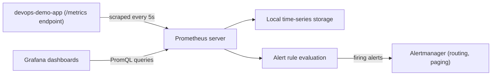

# Module 11: Observability — Handout

## Learning objectives

By the end of this module you can:

- Distinguish monitoring from observability using the known-unknowns / unknown-unknowns framing
- Describe the three pillars — metrics, logs, traces — and the trade-offs between them
- Classify metrics as counters, gauges, or histograms, and explain what the sample app's `/metrics` endpoint exposes
- Explain Prometheus's pull-based architecture and write basic PromQL, including `rate()` over counters
- Explain what Grafana adds on top of Prometheus
- Apply symptom-based alerting philosophy and explain the golden signals and the RED/USE methods
- Define an SLI and explain how it leads to SLOs (module 12)

## Monitoring vs observability

**Monitoring** is the practice of checking a predefined list of conditions: is the process up, is the disk full, is CPU under 90%? It works exactly as well as your ability to predict failure modes in advance. These are the **known-unknowns** — things you know *could* go wrong, so you installed a check.

**Observability** is a property of a system, borrowed from control theory: can you infer the internal state of the system from its external outputs? The practical test is this: **can you ask a question you did not anticipate, without shipping new code?** "What is the error rate for requests from the canary pods with query strings longer than 100 characters, since 14:00?" If answering that requires adding a log line and redeploying, you have monitoring. If your existing telemetry can answer it, you have observability.

The distinction matters because modern distributed systems fail in **unknown-unknown** ways — novel, emergent combinations that no one predicted and no predefined check covers. You felt this in lab 10: "judging the canary" meant scrolling raw `kubectl logs` output and guessing. This module replaces guessing with queryable telemetry.

## The three pillars

### Metrics

Metrics are **numbers aggregated over time**: request counts, durations, memory bytes. Their defining property is **cost**: because aggregation happens at the source, a counter costs the same to store whether it counted ten requests or ten million. That makes metrics ideal for dashboards, trend analysis, and alerting — anything that needs cheap, long-retention, math-friendly data.

Their weakness is the mirror image: **aggregation destroys detail**. A counter can tell you that errors rose at 14:02; it can never tell you which request failed or why. You cannot reconstruct individual events from an aggregate.

Metric types, precisely:

- **Counter** — a value that only increases (and resets to zero on process restart). Examples: requests served, errors, bytes sent. `demo_app_requests_total` is a counter — the `_total` suffix is the naming convention. The raw value is rarely interesting; its **rate of change** is.
- **Gauge** — a value that goes up and down; a snapshot of "right now". Examples: memory in use, active connections, queue depth. `demo_app_uptime_seconds` is a gauge: you read its current value directly, and it drops back to zero when the process restarts.
- **Histogram** — observations counted into buckets ("how many requests took under 10ms, under 50ms, ..."), from which you can compute **percentiles** (p50, p95, p99). Histograms are essential for latency, because averages hide the tail: if 99 requests take 10ms and one takes 5 seconds, the average (~60ms) looks healthy while one user suffered. The sample app does not expose a histogram — a natural capstone extension.

### Logs

Logs are timestamped **event records** — the richest pillar, carrying full per-event detail. That richness is also the cost: log volume scales linearly with traffic, and storing and indexing it is expensive.

Two practices turn logs from grep-fodder into a queryable dataset:

- **Structured logging**: emit JSON, not prose. `{"ts":"2026-07-13T14:02:11.532Z","method":"GET","url":"/health","status":200}` can be filtered, grouped, and aggregated by any field. `GET /health 200` in free text can only be grepped. The lab converts the sample app's log line to exactly this format.
- **Correlation IDs**: generate a unique ID when a request enters the system, propagate it through every service call (typically in an HTTP header), and stamp it on every log line the request causes. One query then reconstructs the full story of any request across all services.

### Traces

A **trace** follows a single request across service boundaries. It is a tree of **spans**, where each span is one timed operation — an HTTP call, a database query — with a start time, duration, and parent. Traces answer the question metrics and logs cannot: "this checkout took 3 seconds — *where did the time go*?" In a thirty-service system, the answer is often a hop nobody suspected.

**OpenTelemetry (OTel)** is the vendor-neutral standard for producing telemetry — traces especially, but also metrics and logs. Its strategic value: instrumentation lives in your code and is expensive to change, while the backend (Jaeger, Grafana Tempo, commercial vendors) is a swappable choice. Instrument once with OTel, point it anywhere. Our single-service app has no cross-service hops, so this course keeps traces at concept level.

### Using the pillars together

| | Metrics | Logs | Traces |
| --- | --- | --- | --- |
| Cost | Cheap, fixed | Expensive, scales with traffic | Medium (sampled) |
| Detail | Aggregates only | Full per-event | Per-request, cross-service |
| Question answered | "How much? How fast?" | "What exactly happened?" | "Where in the chain?" |

The canonical incident workflow chains them: a metric alert fires (symptom detected), the trace shows which service in the request path is failing, and that service's logs say why.

## Prometheus

Prometheus is the de facto standard open-source metrics system. Its architecture is **pull-based**: Prometheus periodically sends `HTTP GET /metrics` to each configured **target** and stores the returned samples as time series in its local database.



Why pull instead of push?

- **Target health is free.** Every scrape produces a synthetic `up` metric: 1 if the scrape succeeded, 0 if not. A dead application cannot push "I am dead"; a failed pull says it perfectly. The lab's `AppDown` alert is one line: `up{job="demo-app"} == 0`.
- **Applications stay simple.** The app exposes a text endpoint and knows nothing about the monitoring system — no agent, no credentials, no retry logic. Our app has produced the format since module 2 with a template string.
- **Configuration is central.** What gets scraped, and how often, lives in `prometheus.yml` — one place to audit.

(Push gateways exist for short-lived batch jobs that cannot be scraped, but pull is the default model.)

The **exposition format** is deliberately trivial: `metric_name value`, one per line, plain text. Production exporters add `# HELP`/`# TYPE` comments and **labels** — key-value dimensions like `http_requests_total{method="GET",status="200"}` — which let queries filter and group. One caution: labels multiply time series, so a label with unbounded values (user IDs, URLs with IDs in them) creates unbounded cardinality and will eventually take Prometheus down.

### PromQL and rate()

PromQL is Prometheus's query language. The three queries you will run in the lab:

```promql
demo_app_requests_total              # raw counter: an ever-climbing line
demo_app_uptime_seconds              # gauge: read the current value directly
rate(demo_app_requests_total[1m])    # per-second request rate over the last minute
```

**Never graph a raw counter.** A counter's absolute value ("1,547 requests since... whenever the pod started") carries almost no information; the **slope** is the signal. `rate()` computes the per-second rate of change over the range window (`[1m]`), automatically handling counter resets caused by restarts. The result answers the actual question: how busy is the service *right now*? Rule of thumb: counters are always wrapped in `rate()` (or `increase()`, which is rate multiplied by the window — "how many new requests this window") before graphing or alerting. Gauges, by contrast, are read directly — `rate()` on a gauge is meaningless.

## Grafana

Grafana is the visualization layer. The division of labor: Prometheus scrapes, stores, and evaluates rules; Grafana sends it PromQL queries and draws the results.

- A **data source** tells Grafana where to send queries. In the lab it is `http://prometheus:9090` — the Docker Compose service name, resolved by the container DNS, because Grafana connects from *inside* the compose network (using `localhost` here is the single most common lab mistake).
- A **dashboard** is a grid of **panels**; each panel pairs one query with one visualization — a time-series panel for `rate(...)`, a stat or gauge panel for a current value like uptime.

One Grafana instance can front many data sources — Prometheus for metrics, Loki for logs, Tempo for traces — making it the usual "single pane of glass".

## Alerting philosophy

**Alert on symptoms, not causes.** A symptom is what users experience: elevated error rate, high latency, the service being down. A cause is an internal state: CPU high, disk 80% full, a pod restarted. Cause-based alerts fail in both directions — they page when users are unaffected (CPU spiked, service absorbed it) and stay silent for failure modes you never predicted. A symptom alert catches *every* cause, including novel ones. Cause-level signals belong on dashboards for diagnosis, not in pagers.

**Page only on urgent, actionable, user-facing impact.** Everything else becomes a ticket or an email. Noisy alerts cause **alert fatigue**: humans learn to ignore the pager, and then the real page gets ignored too. The `for:` clause in alert rules (the lab uses `for: 30s`) is fatigue engineering — a condition must persist before firing, so one blipped scrape pages nobody.

**Every alert links to a runbook**: what this alert means, how to verify it is real, what to do about it. And alert rules get reviewed like code — rules that never fire or always get ignored are deleted.

## What to measure: golden signals, RED, USE

Google's SRE book names **four golden signals**; if you can measure only four things about a user-facing system, measure these:

1. **Latency** — how long requests take (use histogram percentiles, not averages)
2. **Traffic** — demand, e.g. `rate(demo_app_requests_total[1m])`
3. **Errors** — the fraction of requests failing
4. **Saturation** — how "full" the service is (memory, queue depth); the leading indicator that predicts trouble

Two mnemonics make this mechanical. **RED** (Rate, Errors, Duration) applies to every request-driven *service* — it is the golden signals minus saturation. **USE** (Utilization, Saturation, Errors) applies to every *resource* — CPUs, disks, network, queues. Dashboard every service with RED and every resource with USE and you have covered the ground.

## SLIs: from measurement to intent

A **Service Level Indicator** is a metric deliberately chosen to represent user-perceived quality: "the fraction of requests answered successfully in under 300ms", or — as a simple availability proxy for our app — "the fraction of scrapes where the app was up". An SLI turns the vague "is the service healthy?" into a number.

The payoff comes in module 12: put a **target** on an SLI and you have an SLO; subtract the SLO from 100% and you have an **error budget** — the amount of unreliability you are allowed to spend. The Prometheus stack you build in this module's lab is exactly what you will query to compute it.

## Key takeaways

- Observability means you can ask new questions of a running system without shipping new code; monitoring only answers the questions you pre-installed.
- Metrics are cheap aggregates with no per-request detail; logs are rich and expensive (structure them as JSON, correlate with request IDs); traces locate problems across services, with OpenTelemetry as the vendor-neutral standard.
- `demo_app_requests_total` is a counter (only climbs, wrap in `rate()`); `demo_app_uptime_seconds` is a gauge (read directly).
- Prometheus pulls `/metrics` from targets; a failed scrape sets `up` to 0, which is itself the simplest availability signal.
- Never graph or alert on a raw counter — `rate()` extracts the signal and survives restarts.
- Alert on symptoms users feel, keep every page actionable, attach runbooks, and use `for:` durations to suppress blips.
- Golden signals (latency, traffic, errors, saturation), RED for services, USE for resources; SLIs formalize "healthy" into a number SLOs can target.

## Further Reading

- [Google SRE Book — Chapter 6: Monitoring Distributed Systems](https://sre.google/sre-book/monitoring-distributed-systems/) (golden signals, symptoms vs causes)
- [Prometheus documentation — Overview and data model](https://prometheus.io/docs/introduction/overview/)
- [Prometheus documentation — Querying basics and rate()](https://prometheus.io/docs/prometheus/latest/querying/basics/)
- [Grafana documentation — Get started with Grafana and Prometheus](https://grafana.com/docs/grafana/latest/getting-started/get-started-grafana-prometheus/)
- [OpenTelemetry documentation — Concepts](https://opentelemetry.io/docs/concepts/)
- [Tom Wilkie — The RED Method](https://grafana.com/blog/2018/08/02/the-red-method-how-to-instrument-your-services/)
- [Brendan Gregg — The USE Method](https://www.brendangregg.com/usemethod.html)
- Charity Majors, Liz Fong-Jones, George Miranda, *Observability Engineering* (O'Reilly)
