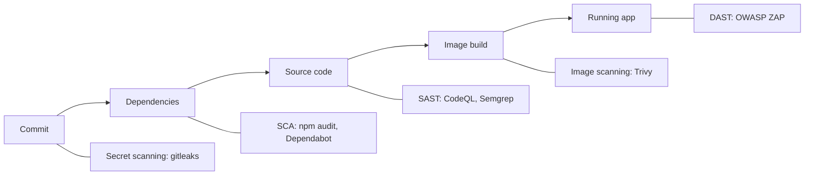

# Module 12: DevSecOps & SRE Fundamentals — Handout

## Learning objectives

By the end of this module you can:

- Explain shift-left security and the vulnerability cost curve
- Map the pipeline security toolbox to pipeline stages: secret scanning, SCA, SAST, image scanning, DAST
- Apply least-privilege principles to CI pipelines (`GITHUB_TOKEN` permissions)
- Explain artifact signing and provenance (SLSA, sigstore/cosign) at concept level
- Define SLI, SLO, and SLA precisely and compute an error budget from an SLO
- Define toil and explain why SRE teams budget it
- Describe humane on-call, incident response roles, and severity levels
- Write a blameless postmortem and explain why blamelessness matters
- Explain chaos engineering and game days at concept level

## Part 1: DevSecOps

### Shift-left security

Module 1 described the wall between development and operations. Most organizations kept one more wall standing: security as a **late gate** — a specialist review scheduled in the final week before launch, producing findings when they are most expensive to fix. Predictably, findings got waived, deferred, or discovered later by attackers.

The cost asymmetry is stark. A vulnerability caught in design review costs a diagram change. Caught in CI, it costs minutes. Caught in production, it costs an incident at best — and at worst a breach, with disclosure obligations, legal exposure, and reputation damage attached. **Shifting left** means moving detection toward the cheap end of that curve, automatically, on every change. DevSecOps is the same move DevOps made with operations: replace a gatekeeping specialist team with shared ownership plus automated guardrails in the pipeline.

### The pipeline security toolbox

Each tool class catches a different kind of problem at a different stage. They complement each other; none replaces another.



**Secret scanning (gitleaks).** Finds credentials — API keys, tokens, private keys — committed to Git, including in **history**: deleting a secret in the next commit does not remove it from the repository. You used gitleaks manually in module 9; the lab turns it into a CI job on every push. Operational rule: a secret that has touched a remote is compromised; **rotate it** — history rewriting is cleanup, not remediation.

**SCA — Software Composition Analysis (npm audit, Dependabot).** Scans your dependency tree against databases of known CVEs. A typical application is a thin layer of your code on hundreds of transitive packages, so your dependencies *are* most of your attack surface. `npm audit` checks on demand; Dependabot continuously opens PRs to bump vulnerable versions. This is also where the **supply chain problem** lives: attackers publish malicious packages (**typosquatting** — `lodahs` for `lodash`; one typo installs malware) or compromise legitimate ones (the `event-stream` incident). **Lockfiles** (`package-lock.json`) pin the exact resolved version of every package, so every install produces the same tree — an integrity guarantee that matters even for a project with zero dependencies, because it constrains what a future `npm install` is allowed to do.

**SAST — Static Application Security Testing (CodeQL, Semgrep).** Analyzes *your own* source code without running it, hunting for dangerous patterns: injection, unsafe deserialization, path traversal. CodeQL builds a queryable semantic database of the code (free for public GitHub repositories); Semgrep runs fast pattern-based rules. The practical hazard is false positives: an untriaged report with 400 findings gets ignored, which is worse than a tuned one with 12 real findings — module 11's alert-fatigue lesson applies to security tooling too.

**Container image scanning (Trivy).** An image is a snapshot of an operating system plus your app, and Trivy scans **both layers**: the OS packages of the base image (alpine's apk packages, in our case) and the application dependencies. Your code can be flawless while the base image ships a vulnerable OpenSSL. Images also **age**: an image that scanned clean in January can be full of CVEs by June with zero code changes, because new vulnerabilities were published against the packages it froze. Hence: pin a specific base tag, rebuild and rescan on a schedule, not only on code change.

**DAST — Dynamic Application Security Testing (OWASP ZAP).** Probes the *running* application over HTTP, finding what static analysis cannot: authentication bypasses, misconfigured headers and TLS, injection confirmed against live responses. It is the most realistic and most expensive check, typically run nightly or pre-release against staging. Awareness level for this course.

### Least privilege for pipelines

CI pipelines are code that runs with credentials, which makes them targets. In GitHub Actions, every workflow receives a `GITHUB_TOKEN`, and its default permissions are often broader than the workflow needs. If a third-party action you use is compromised — supply chain again — the malicious code inherits your token. Setting, at the top of the workflow:

```yaml
permissions:
  contents: read
```

reduces the blast radius from "attacker can push code to your repo" to "attacker can read a repo". Grant the minimum at workflow level and widen per-job only where genuinely required. The same principle applies to deploy keys, cloud IAM roles, and cluster credentials — recall the GitOps argument from module 10, where pull-based agents exist partly so that cluster admin credentials never sit in CI at all.

### Signing and provenance

The remaining question: how does a consumer of your artifact know it was built by *your* pipeline from *your* source? **Provenance** is attested metadata answering who built what, from which commit, on which system. **SLSA** (Supply-chain Levels for Software Artifacts) is a framework of maturity levels for exactly this. **Sigstore/cosign** provides practical signing: sign images at build time, verify signatures before deployment, so a tampered or substituted image is rejected. Concept level here — know the terms and the problem they solve.

### OWASP Top 10

The OWASP Top 10 is the canonical awareness list of critical web application risks: broken access control (perennially number one), injection, cryptographic failures, security misconfiguration, vulnerable and outdated components, and more. It is a shared vocabulary, not a compliance checklist. Note which items tooling covers: SCA handles "vulnerable components", SAST helps with injection — but broken access control is a *logic* problem no scanner reliably finds. It needs code review and tests, which is the argument for security being a team skill rather than a tool purchase.

## Part 2: SRE

### Operations as a software problem

Google's Ben Treynor Sloss defined SRE as "what happens when you ask a software engineer to design an operations team." Where DevOps is a philosophy, SRE is one concrete, opinionated implementation: treat reliability as an engineering problem with measurements, targets, budgets, and automation. Its core instruments are SLIs, SLOs, error budgets, toil budgets, and blameless postmortems.

### SLI, SLO, SLA

Three terms, three different things — anchor them by their last words: **indicator** = measurement, **objective** = target, **agreement** = contract.

- **SLI (Service Level Indicator)**: a metric chosen to represent user-perceived quality. For our app: the fraction of successful `/health` checks, or the fraction of scrapes where the target was up.
- **SLO (Service Level Objective)**: an internal target for the SLI. Example: 99.9% of health checks succeed, measured over a rolling month.
- **SLA (Service Level Agreement)**: a contract with an external party, with penalties — service credits, refunds — if breached. Example: 99.5% monthly availability or the customer gets credits.

The SLO is deliberately stricter than the SLA: the SLO is your internal tripwire that triggers action; the SLA is the legal floor you must never hit. And there is a dependency order — no SLI, no SLO: you cannot target what you do not measure, which is why module 11 came first.

### Error budgets

100% is the wrong reliability target. Users cannot distinguish 99.99% from 100% — their own wifi fails more often than that — and each additional nine costs roughly ten times more engineering. So instead of maximizing reliability, SRE fixes a target and treats the remainder as spendable:

**Error budget = 1 − SLO.**

For an SLO of 99.9% over 30 days: 0.001 × 30 × 24 × 60 ≈ **43 minutes** of allowed downtime. For 99.5% over 30 days: 0.005 × 30 × 24 × 60 = **216 minutes** (the number you compute in the lab). Downtime within budget is not failure — it is a resource you spend deliberately on releases, experiments, and maintenance.

The budget becomes a **peace treaty** between velocity and reliability. Budget healthy: ship fast, take risks. Budget exhausted: feature releases **freeze**, and engineering effort shifts to reliability until the budget recovers. The freeze is not punishment; it is the consequence both sides agreed to in advance, replacing module 1's dev-versus-ops turf war with arithmetic. **Burn rate** measures how fast the budget is being consumed — burning 5% of a monthly budget in one hour should page someone even though the SLO is not yet breached. Burn-rate alerts are the mature form of module 11's symptom-based alerting.

### Toil

Toil is operational work that is **manual, repetitive, automatable, reactive, devoid of lasting value, and — critically — scales linearly with the service**. Hand-restarting pods, rotating certificates by hand, copy-pasting deploy commands. Because it scales with growth, unchecked toil eventually consumes a team — the ops death spiral from module 1. Google SRE caps toil at around 50% of an SRE's time; the other half goes to engineering toil away. Notice that this entire course has been a toil-elimination arc: CI automated testing, containers and Terraform automated environments, module 10 automated deployment.

### On-call and incident response

On-call can be humane if engineered: shared **rotations** with a primary and secondary, **escalation** paths when a page is not acknowledged, and — most importantly — alert quality. Every page must be urgent, actionable, and user-impacting (module 11), and should link to a **runbook**. Track pages per shift: a noisy on-call means the *system* needs fixing, not tougher humans.

When an incident happens, structure beats heroics:

- The **Incident Commander (IC)** owns coordination and decisions — and does not debug. Coordination is a full-time job; the classic failure mode is five people debugging while nobody decides.
- The **communications lead** posts regular status updates and shields responders from "any update?" interruptions.
- Subject-matter experts investigate and mitigate.
- **Severity levels** (SEV1: critical user-facing impact, all hands; SEV2: significant degradation; SEV3: minor) pre-negotiate the response — who gets paged, how often updates go out — so nobody argues about proportionality at 3 a.m.

The prime directive during response: **mitigate first, understand later**. Restore service, then investigate.

### Blameless postmortems

After every significant incident, write a postmortem: what happened, what the impact was, a timeline, why it happened, and what will change. The non-negotiable property is **blamelessness** — and the reason is informational, not sentimental: blame destroys information flow. People who fear punishment omit details, and the organization loses the truth about its own systems, guaranteeing a repeat.

Two disciplines follow. First, prefer **contributing factors** over a single "root cause" — real incidents emerge from several interacting causes, and stopping at one (especially "human error") truncates the learning. When a human error is involved, the question is why the *system* allowed that error to matter: why was the dangerous command possible, unconfirmed, and unrecoverable? Second, every postmortem produces **action items with owners and deadlines** — otherwise it is a confession, not an engineering document. The lab has you write one, using a full template, about an outage you stage yourself.

### Chaos engineering

Chaos engineering verifies resilience claims by experiment: define a steady-state hypothesis ("we survive an app restart without user-visible errors"), inject the failure with a minimal blast radius, observe, and halt on surprise. **Game days** are the team-practice version — scheduled exercises where you break something on purpose and rehearse the response. Netflix's Chaos Monkey, which randomly terminates instances, made failure a design constraint rather than a surprise. The lab runs a miniature game day: stop the app container, watch the module 11 `AppDown` alert fire, recover, and write the postmortem.

## The end of the journey

In module 1, `devops-demo-app` was thirty lines of Node.js that ran on one laptop. Twelve modules later, the same app: lives in a repository with a protected main branch and PR review (module 2); is health-checked by script (module 3); is linted and tested by CI on every push (modules 4–5); runs in a container defined by a Dockerfile (module 6); is deployed on Kubernetes with three replicas and probes (module 7); has its infrastructure defined in Terraform (module 8); reads its configuration from the environment (module 9); rolls out via canary with instant rollback (module 10); is scraped by Prometheus, graphed in Grafana, and alerted on (module 11); and is now scanned in CI, covered by an SLO with a computed error budget, and backed by a postmortem practice (module 12). Nothing in that list required heroics — only feedback loops and automation, applied one layer at a time. That is DevOps.

## Key takeaways

- Shift security left: the cost of a vulnerability grows by orders of magnitude from design review to production breach.
- Know the toolbox by problem class: secret scanning (leaked credentials, including history), SCA (known CVEs in dependencies), SAST (dangerous patterns in your code), image scanning (OS packages age inside frozen images), DAST (runtime misconfigurations).
- Lockfiles, typosquatting awareness, least-privilege `GITHUB_TOKEN` permissions, and signing/provenance (SLSA, cosign) are the supply-chain defenses.
- SLI measures, SLO targets, SLA contracts; error budget = 1 − SLO (99.5%/30 days = 216 minutes) and is the agreed-upon peace treaty between shipping and stability.
- Toil is manual, repetitive, automatable work that scales with the service — budget it and engineer it away.
- Incidents need roles (IC coordinates and does not debug, comms lead communicates), severity levels, and mitigate-first discipline.
- Postmortems are blameless because blame destroys the information flow that prevention depends on; contributing factors over root cause; action items with owners.

## Further Reading

- [Google SRE Book (free online)](https://sre.google/sre-book/table-of-contents/) — especially chapters on SLOs, eliminating toil, and postmortem culture
- [Google SRE Workbook — Implementing SLOs](https://sre.google/workbook/implementing-slos/)
- [OWASP Top 10](https://owasp.org/www-project-top-ten/)
- [Trivy documentation](https://aquasecurity.github.io/trivy/)
- [gitleaks](https://github.com/gitleaks/gitleaks) and [gitleaks-action](https://github.com/gitleaks/gitleaks-action)
- [GitHub Docs — Assigning permissions to jobs (GITHUB_TOKEN)](https://docs.github.com/en/actions/using-jobs/assigning-permissions-to-jobs)
- [SLSA — Supply-chain Levels for Software Artifacts](https://slsa.dev/)
- [Sigstore](https://www.sigstore.dev/)
- [Principles of Chaos Engineering](https://principlesofchaos.org/)
- [PagerDuty Incident Response guide](https://response.pagerduty.com/)
